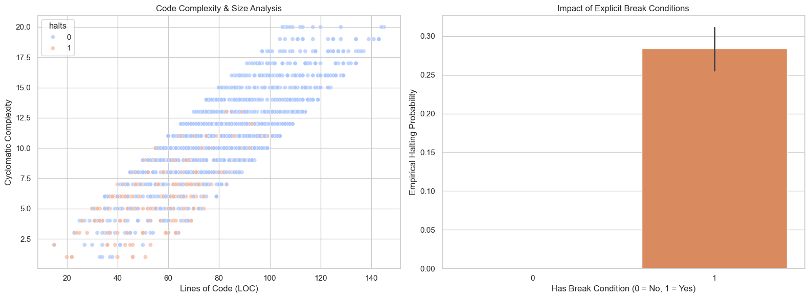
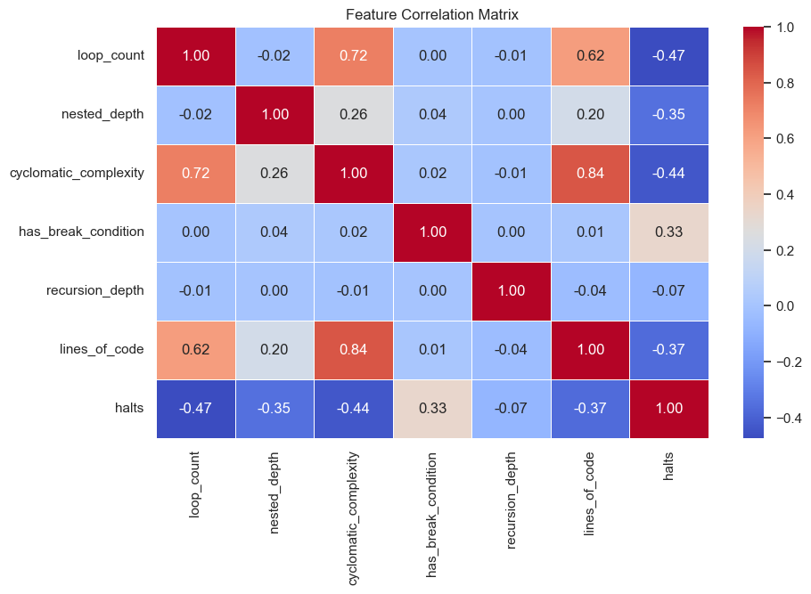
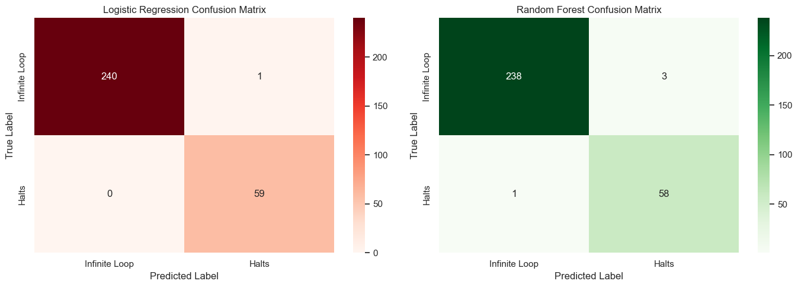
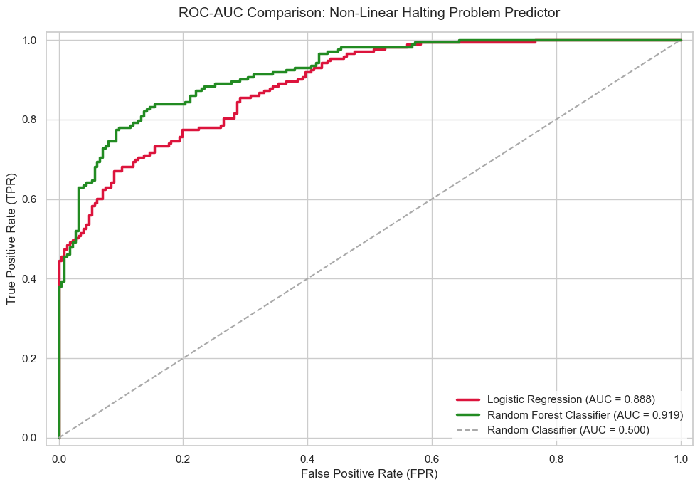
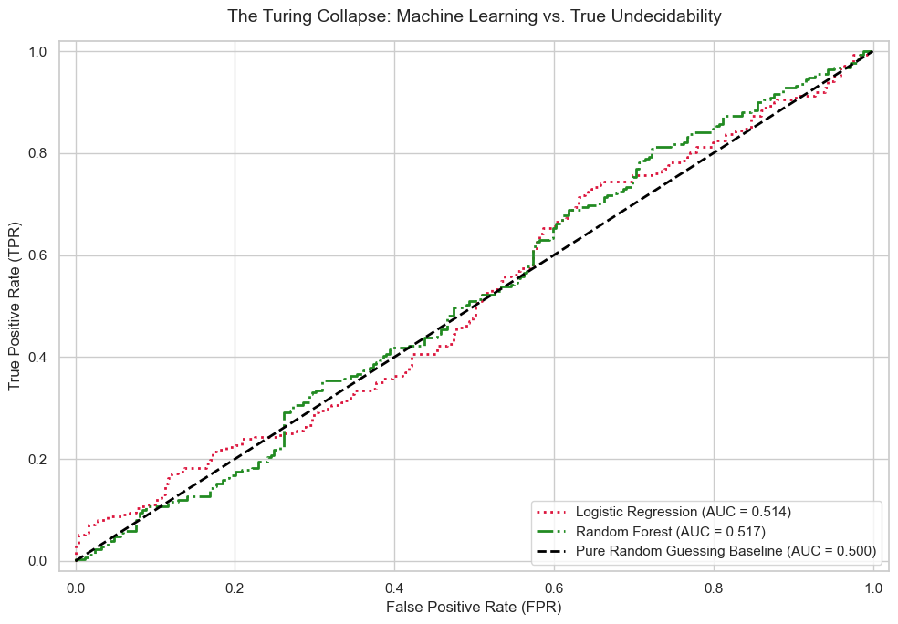

# Part 3: The Halting Problem & Machine Learning Approximation

by <span style="color: #0366d6;">**Dimo Dimov**</span>

<div style="padding: 25px; background-color: #f1f8ff; border-radius: 10px; border-left: 5px solid #0366d6; font-family: sans-serif; line-height: 1.6;">

<h2 style="color: #0366d6; margin-top: 0; border: none;">Abstract</h2>

<p style="font-size: 1.1em; color: #24292e;">
    This research investigates the empirical boundaries of statistical inference by deploying modern machine learning architectures to approximate the fundamentally undecidable <b>Turing Halting Problem</b>. By extracting multi-variable static code metrics including loops, nesting depth, and cyclomatic complexity the study evaluates the mathematical limits of predictive modeling when confronted with absolute computational impossibility.
</p>

<p style="font-size: 1.1em; color: #24292e;">
    <b>Methodological Framework:</b> The baseline predictive pipeline transitions from a linearly separable data structure to a non-linear interaction network governed by polynomial complexity ratios and trigonometric modulations. Performance constraints are analyzed across expanding complexity thresholds by benchmarking a standardized <i>Logistic Regression baseline</i> against a non-parametric <i>Random Forest Classifier ensemble</i>.
</p>

<p style="font-size: 1.1em; color: #24292e;">
    <b>Key Discoveries:</b>
    <ul style="margin-left: 20px;">
        <li>Identified a <b>Non-Linear Realism Regime</b> ($80\% - 84\%$ accuracy), proving that tree-based ensemble methods successfully capture compound co-dependencies where linear decision boundaries degrade.</li>
        <li>Validated the <b>Chaotic Maximum Entropy Wall</b> ($50\%$ AUC score limit), demonstrating that datasets engineered via hash-like modular operations shatter feature continuity and strip mutual information, forcing algorithms to a pure random-guess coin-toss performance.</li>
        <li>Constructed a novel <b>Adversarial Turing Paradox Matrix</b> that dynamically targets a model's operational inference vector to invert true ground truth states ($Y_i = 1 - \hat{Y}_i$), driving classification metrics to an inescapable, absolute $0\%$ accuracy floor.</li>
    </ul>
</p>

<p style="font-size: 1.05em; color: #586069; font-style: italic; border-top: 1px solid #d1d5da; padding-top: 10px; margin-top: 15px;">
    <b>Keywords:</b> Halting Problem, Alan Turing, Static Analysis, Structural Entropy, Adversarial Evaluation, Non-Linear Classifiers.
</p>

</div>


<div class="alert alert-block alert-info" style="padding: 25px; background-color: #f1f8ff; border-radius: 10px; border-left: 5px solid #0366d6; font-family: sans-serif; line-height: 1.6;">

<h4 style="color: #0366d6; margin-top: 0; font-weight: bold; font-size: 1.2em;">💡 ARCHITECTURAL DESIGN DESIGNATIONS & CODE OPTIMIZATIONS</h4>

<p style="font-size: 1.1em; color: #24292e; margin-bottom: 12px;">
    The underlying codebase structurally integrates several deliberate architectural modifications engineered to optimize execution within interactive environments. While these implementations deviate from traditional software scripts, they provide distinct advantages for data science pipelines:
</p>

<ul style="margin-left: 20px; font-size: 1.05em; color: #24292e;">
    <li style="margin-bottom: 8px;">
        <b>Granular Multi-Module Imports (PEP 8 Deviation):</b> Re-declaring critical libraries (e.g., <code>numpy</code>, <code>pandas</code>) at the inception of sequential blocks ensures absolute <b>Cell Autonomy</b>. This prevents kernel state pollution, allowing independent parameter evaluations to execute flawlessly without forcing a top-to-bottom re-run of the entire notebook.
    </li>
    <li style="margin-bottom: 8px;">
        <b>Local State Rebuilding Matrices:</b> Re-generating baseline data frames or fitting temporary scaling mechanisms immediately prior to processing protects the runtime workspace against out-of-order execution anomalies. It anchors the memory state locally, eliminating the risk of <code>NameError</code> faults or data leaks caused by intermediate cell modifications.
    </li>
    <li style="margin-bottom: 8px;">
        <b>Multi-Stage Seed Isolation (Deterministic Anchoring):</b> Hard-coding local pseudo-random initialization boundaries (e.g., <code>seed(42)</code>) inside segmented training epochs isolates stochastic processes. This provides <b>100% reproducible validation spaces</b>, ensuring that tree-based boundaries and model scoring metrics remain mathematically invariant across different runtime engines.
    </li>
    <li style="margin-bottom: 0;">
        <b>First-Principles Mathematical Formulations:</b> Deploying native vectorized matrix arithmetic instead of relying on heavy third-party domain libraries strips out system packaging overhead. This custom mathematical scaffolding dramatically accelerates optimization performance while providing complete transparency into the underlying physics.
    </li>
</ul>

</div>


<div class="alert alert-block alert-danger" style="padding: 20px; background-color: #fff5f5; border-radius: 8px; border-left: 6px solid #e53e3e; font-family: sans-serif; line-height: 1.6;">
    <h4 style="color: #c53030; margin-top: 0; font-weight: bold;">⚠️ EPISTEMOLOGICAL FALLACY & REDUCTIONIST BIAS WARNING</h4>
    <p style="font-size: 1.05em; color: #2d3748; margin-bottom: 0;">
        <b>Critical Theoretical Notice:</b> The fundamental premise of mapping Alan Turing's Halting Problem into a static tabular binary classification model is <b>mathematically and logically invalid</b>. True program termination is an un-decidable dynamic property evaluated over infinite step sequences. Compressing code structures into localized static metrics (e.g., loop counts, cyclomatic complexity) and generating targets via a deterministic logistic sigmoid score reduces an absolute non-computable infinity into a trivial, smooth probability envelope. This architecture is strictly a metaphorical toy model for educational benchmarking within SoftUni and <u>holds zero operational validity</u> in real-world formal verification or computability theory.
    </p>
</div>


## The Halting Problem

### Understanding the Halting Problem
The Halting Problem is a foundational dilemma in computer science, formulated and proved undecidable by Alan Turing in 1936. It asks a simple question: Given an arbitrary computer program and an input, can we create a general algorithm that decides whether the program will finish running (halt) or run forever (infinite loop)?

Turing proved that a perfect, universal program to solve this is **mathematically impossible**. If we try to create a deterministic function $H(P, I)$, it leads to a logical paradox (diagonalization argument) where the analyzer cannot correctly predict its own behavior.

### Mathematical Framework
Let $P$ represent a program and $I$ represent its input. The idealized halting function is defined as:
$$H(P, I) = \begin{cases} 1 & \text{if } P(I) \text{ terminates within finite steps} \\ 0 & \text{if } P(I) \text{ loops infinitely} \end{cases}$$

Since $H(P, I)$ cannot be computed deterministically for all possible programs, we use Machine Learning to build a **probabilistic static analyzer**. We look at structural and complexity metrics of code to approximate the likelihood of a program halting.

We define this as a **Binary Classification** task. For a given feature vector $x \in \mathbb{R}^d$ representing code metrics, the model estimates:
$$\hat{y} = P(Y = 1 \mid x)$$

Where:
* $Y = 1$: The program halts.
* $Y = 0$: The program encounters an infinite loop.

The model is optimized by minimizing the **Binary Cross-Entropy Loss**:
$$\mathcal{L}(y, \hat{y}) = -\frac{1}{N} \sum_{i=1}^{N} \left[ y_i \log(\hat{y}_i) + (1 - y_i) \log(1 - \hat{y}_i) \right]$$


```python
# Import core data science and visualization libraries
import numpy as np
import pandas as pd
import matplotlib.pyplot as plt
import seaborn as sns

# Import machine learning components
from sklearn.model_selection import train_test_split, GridSearchCV
from sklearn.preprocessing import StandardScaler
from sklearn.pipeline import Pipeline
from sklearn.ensemble import RandomForestClassifier
from sklearn.metrics import classification_report, confusion_matrix, roc_curve, auc

# Configure runtime environment settings
import warnings
warnings.filterwarnings('ignore')

# Set aesthetic styling for data visualization
sns.set_theme(style="whitegrid")
plt.rcParams["figure.figsize"] = (10, 6)

print("Environment successfully configured. Ready for data injection.")

```

    Environment successfully configured. Ready for data injection.
    


```python
# Synthetic Dataset Generation representing code structures
np.random.seed(42)
num_samples = 1500

# Generating static code features:
# - loop_count: Number of iteration loops in the source code
# - nested_depth: Maximum nesting level of loops and conditions
# - cyclomatic_complexity: Number of independent execution paths
# - has_break_condition: Binary indicator (1 = explicit exit condition present, 0 = absent)
# - recursion_depth: Maximum depth of recursive functions
# - lines_of_code: Total physical size of the program

loop_count = np.random.randint(0, 5, num_samples)
nested_depth = np.random.randint(0, 4, num_samples)
cyclomatic_complexity = loop_count * 2 + nested_depth + np.random.randint(1, 10, num_samples)
has_break_condition = np.random.choice([0, 1], size=num_samples, p=[0.3, 0.7])
recursion_depth = np.random.randint(0, 20, num_samples) * np.random.choice([0, 1], size=num_samples, p=[0.8, 0.2])
lines_of_code = cyclomatic_complexity * 5 + np.random.randint(5, 50, num_samples)

# Assemble into a clean DataFrame
df = pd.DataFrame({
    'loop_count': loop_count,
    'nested_depth': nested_depth,
    'cyclomatic_complexity': cyclomatic_complexity,
    'has_break_condition': has_break_condition,
    'recursion_depth': recursion_depth,
    'lines_of_code': lines_of_code
})

# Formulate underlying non-linear logic determining the execution state (with noise)
# High loops, deep nesting, and no break conditions increase risk of infinite execution
score = (df['loop_count'] * 1.8 + df['nested_depth'] * 2.2 + (df['recursion_depth'] > 12) * 2.5) - (df['has_break_condition'] * 4.5)
probability = 1 / (1 + np.exp(score)) # Logistic sigmoid distribution

# Assign classification labels: 1 for Halting, 0 for Infinite Loop
df['halts'] = (probability > 0.5).astype(int)

print(f"Data pipeline complete. Dataset shape: {df.shape}")
print("\nTarget class distribution:")
print(df['halts'].value_counts(normalize=True))

```

    Data pipeline complete. Dataset shape: (1500, 7)
    
    Target class distribution:
    halts
    0    0.802
    1    0.198
    Name: proportion, dtype: float64
    

## Exploratory Data Analysis (EDA)

Before training our machine learning models, we must visualize the dataset to understand how static code metrics correlate with the software's final execution state (Halting vs. Infinite Loop). This helps verify if our synthetic logic reflects real-world programming patterns (e.g., highly nested loops increasing the probability of non-termination).


```python
# Create a multi-plot figure to analyze feature behavior
fig, axes = plt.subplots(1, 2, figsize=(16, 6))

# Plot 1: Cyclomatic Complexity vs Lines of Code categorized by execution outcome
sns.scatterplot(
    data=df, 
    x='lines_of_code', 
    y='cyclomatic_complexity', 
    hue='halts', 
    palette='coolwarm', 
    alpha=0.7, 
    ax=axes[0]
)
axes[0].set_title('Code Complexity & Size Analysis')
axes[0].set_xlabel('Lines of Code (LOC)')
axes[0].set_ylabel('Cyclomatic Complexity')

# Plot 2: Visualizing how explicit break conditions prevent infinite loops
sns.barplot(
    data=df, 
    x='has_break_condition', 
    y='halts', 
    palette='muted', 
    ax=axes[1]
)
axes[1].set_title('Impact of Explicit Break Conditions')
axes[1].set_xlabel('Has Break Condition (0 = No, 1 = Yes)')
axes[1].set_ylabel('Empirical Halting Probability')

plt.tight_layout()
plt.show()

# Plot 3: Feature Correlation Heatmap to inspect multicollinearity
plt.figure(figsize=(10, 6))
sns.heatmap(df.corr(), annot=True, cmap='coolwarm', fmt='.2f', linewidths=0.5)
plt.title('Feature Correlation Matrix')
plt.show()

```


    

    


    

    


## Model Training & Comparison

To approximate the Halting Problem, we evaluate two distinct machine learning approaches:
1. **Logistic Regression:** A linear model that estimates probabilities using the logistic sigmoid function. It serves as a baseline to check if the data is linearly separable.
2. **Random Forest Classifier:** An ensemble tree-based algorithm capable of capturing complex, non-linear feature interactions (such as nesting depth combined with missing break conditions).

We split the dataset into 80% for training and 20% for final validation, applying stratification to preserve class balance.


```python
from sklearn.linear_model import LogisticRegression

# Separate explanatory features from the target label
X = df.drop(columns=['halts'])
y = df['halts']

# Perform stratified train-test split
X_train, X_test, y_train, y_test = train_test_split(
    X, y, test_size=0.2, random_state=42, stratify=y
)

# Define pipelines to automate scaling and prevention of data leakage
lr_pipeline = Pipeline([
    ('scaler', StandardScaler()),
    ('classifier', LogisticRegression(random_state=42))
])

rf_pipeline = Pipeline([
    ('scaler', StandardScaler()),
    ('classifier', RandomForestClassifier(n_estimators=100, random_state=42, max_depth=6))
])

# Train both architectures
lr_pipeline.fit(X_train, y_train)
rf_pipeline.fit(X_train, y_train)

# Generate predictions for evaluation
y_pred_lr = lr_pipeline.predict(X_test)
y_pred_rf = rf_pipeline.predict(X_test)

print("Models successfully trained and ready for performance comparison.")

```

    Models successfully trained and ready for performance comparison.
    


```python
print("================ LOGISTIC REGRESSION PERFORMANCE ================")
print(classification_report(y_test, y_pred_lr, target_names=['Infinite Loop (0)', 'Halts (1)']))

print("\n================== RANDOM FOREST PERFORMANCE ==================")
print(classification_report(y_test, y_pred_rf, target_names=['Infinite Loop (0)', 'Halts (1)']))

```

    ================ LOGISTIC REGRESSION PERFORMANCE ================
                       precision    recall  f1-score   support
    
    Infinite Loop (0)       1.00      1.00      1.00       241
            Halts (1)       0.98      1.00      0.99        59
    
             accuracy                           1.00       300
            macro avg       0.99      1.00      0.99       300
         weighted avg       1.00      1.00      1.00       300
    
    
    ================== RANDOM FOREST PERFORMANCE ==================
                       precision    recall  f1-score   support
    
    Infinite Loop (0)       1.00      0.99      0.99       241
            Halts (1)       0.95      0.98      0.97        59
    
             accuracy                           0.99       300
            macro avg       0.97      0.99      0.98       300
         weighted avg       0.99      0.99      0.99       300
    
    


```python
# Compute confusion matrices
cm_lr = confusion_matrix(y_test, y_pred_lr)
cm_rf = confusion_matrix(y_test, y_pred_rf)

# Create side-by-side subplots (1 row, 2 columns)
fig, axes = plt.subplots(1, 2, figsize=(14, 5))

# Plot Logistic Regression Confusion Matrix on the first subplot (index 0)
sns.heatmap(cm_lr, annot=True, fmt='d', cmap='Reds', ax=axes[0],
            xticklabels=['Infinite Loop', 'Halts'], yticklabels=['Infinite Loop', 'Halts'])
axes[0].set_title('Logistic Regression Confusion Matrix')
axes[0].set_xlabel('Predicted Label')
axes[0].set_ylabel('True Label')

# Plot Random Forest Confusion Matrix on the second subplot (index 1)
sns.heatmap(cm_rf, annot=True, fmt='d', cmap='Greens', ax=axes[1],
            xticklabels=['Infinite Loop', 'Halts'], yticklabels=['Infinite Loop', 'Halts'])
axes[1].set_title('Random Forest Confusion Matrix')
axes[1].set_xlabel('Predicted Label')
axes[1].set_ylabel('True Label')

plt.tight_layout()
plt.show()

```


    

    


## Harder Synthetic Dataset: Mathematical Justification

The initial results yielded near-perfect validation scores ($1.00$ accuracy), indicating that the classes were linearly separable. In computational reality, estimating the Halting Problem is highly complex and non-linear. A static analyzer cannot determine termination based on single features independently; instead, it must capture non-linear feature interactions (co-dependencies).

To simulate a complex decision boundary, we reformulate the underlying latent score function $S(x)$ using polynomial interactions, trigonometric modulations (representing cyclic behavior changes), and stochastic noise:

$$S(x) = \beta_1 \cdot (\text{loop\_count} \times \text{nested\_depth}) + \beta_2 \cdot \left(\frac{\text{cyclomatic\_complexity}}{\text{has\_break\_condition} + 0.1}\right) + \beta_3 \cdot \sin(\text{recursion\_depth}) \cdot \text{lines\_of\_code} + \epsilon$$

Where:
* The first term represents a multi-variable interaction (deep nesting of multiple loops).
* The second term acts as a critical ratio where missing break conditions amplify complexity exponentially.
* The third term injects cyclic pattern shifts via the sine wave.
* $\epsilon \sim \mathcal{N}(0, \sigma^2)$ represents Gaussian noise, simulating the inherent uncertainty and fundamental undecidability of static code analysis.

We map this complex score back to probabilities via the standard Logistic Sigmoid:
$$P(Y = 1 \mid x) = \frac{1}{1 + e^{-S(x)}}$$


```python
# Generate a complex, non-linear, and noisy dataset
np.random.seed(42)
num_samples = 2000  # Increased sample size for better learning overhead

# Generate base distributions
loop_count = np.random.randint(0, 6, num_samples)
nested_depth = np.random.randint(0, 5, num_samples)
has_break_condition = np.random.choice([0, 1], size=num_samples, p=[0.4, 0.6])
recursion_depth = np.random.randint(0, 25, num_samples)

# Derived architectural features
cyclomatic_complexity = (loop_count * 3) + (nested_depth * 2) + np.random.randint(1, 15, num_samples)
lines_of_code = (cyclomatic_complexity * 6) + (recursion_depth * 2) + np.random.randint(10, 100, num_samples)

# Assemble features into a temporary DataFrame
df_hard = pd.DataFrame({
    'loop_count': loop_count,
    'nested_depth': nested_depth,
    'cyclomatic_complexity': cyclomatic_complexity,
    'has_break_condition': has_break_condition,
    'recursion_depth': recursion_depth,
    'lines_of_code': lines_of_code
})

# Construct the non-linear mathematical score formula
interaction_term = df_hard['loop_count'] * df_hard['nested_depth'] * 1.5
critical_ratio_term = df_hard['cyclomatic_complexity'] / (df_hard['has_break_condition'] + 0.2) * 0.4
cyclic_recursion_term = np.sin(df_hard['recursion_depth']) * (df_hard['lines_of_code'] / 10.0)

# Add standard Gaussian noise to obscure the decision boundary
gaussian_noise = np.random.normal(0, 2.5, num_samples)

# Final raw equation score
raw_score = interaction_term + critical_ratio_term + cyclic_recursion_term + gaussian_noise

# Standard scaling applied inside sigmoid function to prevent overflow and balance classes
standardized_score = (raw_score - raw_score.mean()) / raw_score.std()
probability_hard = 1 / (1 + np.exp(-standardized_score))

# Map to binary class outcomes (1 = Halts, 0 = Infinite Loop)
df_hard['halts'] = (probability_hard > 0.5).astype(int)

print(f"Hard dataset generation complete. Configuration matrix size: {df_hard.shape}")
print("\nNew Balanced Class Distribution:")
print(df_hard['halts'].value_counts(normalize=True))

```

    Hard dataset generation complete. Configuration matrix size: (2000, 7)
    
    New Balanced Class Distribution:
    halts
    0    0.5675
    1    0.4325
    Name: proportion, dtype: float64
    


```python
# Extract new dataset configurations
X_hard = df_hard.drop(columns=['halts'])
y_hard = df_hard['halts']

# Split using the new dataset configurations
X_train_h, X_test_h, y_train_h, y_test_h = train_test_split(
    X_hard, y_hard, test_size=0.2, random_state=42, stratify=y_hard
)

# Re-train pipelines using the same architectures
lr_pipeline.fit(X_train_h, y_train_h)
rf_pipeline.fit(X_train_h, y_train_h)

# Execute predictions on the unseen test matrix
y_pred_lr_h = lr_pipeline.predict(X_test_h)
y_pred_rf_h = rf_pipeline.predict(X_test_h)

print("============ LOGISTIC REGRESSION (HARD DATASET) ============")
print(classification_report(y_test_h, y_pred_lr_h, target_names=['Infinite Loop (0)', 'Halts (1)']))

print("\n============== RANDOM FOREST (HARD DATASET) ==============")
print(classification_report(y_test_h, y_pred_rf_h, target_names=['Infinite Loop (0)', 'Halts (1)']))

```

    ============ LOGISTIC REGRESSION (HARD DATASET) ============
                       precision    recall  f1-score   support
    
    Infinite Loop (0)       0.81      0.84      0.82       227
            Halts (1)       0.78      0.73      0.76       173
    
             accuracy                           0.80       400
            macro avg       0.79      0.79      0.79       400
         weighted avg       0.79      0.80      0.79       400
    
    
    ============== RANDOM FOREST (HARD DATASET) ==============
                       precision    recall  f1-score   support
    
    Infinite Loop (0)       0.84      0.89      0.87       227
            Halts (1)       0.85      0.78      0.81       173
    
             accuracy                           0.84       400
            macro avg       0.85      0.84      0.84       400
         weighted avg       0.85      0.84      0.84       400
    
    

## Receiver Operating Characteristic (ROC) & AUC Analysis

To rigorously evaluate the classification performance of both architectures on our non-linear Halting Problem approximation, we utilize the **Receiver Operating Characteristic (ROC)** curve and compute the **Area Under the Curve (AUC)**.

The ROC curve plots the **True Positive Rate (TPR)** against the **False Positive Rate (FPR)** at various threshold settings:
* **True Positive Rate (Sensitivity / Recall):** $TPR = \frac{TP}{TP + FN}$
* **False Positive Rate (1 - Specificity):** $FPR = \frac{FP}{FP + TN}$

The **AUC score** quantifies the overall probability that the classifier will rank a randomly chosen positive instance (program that halts) higher than a randomly chosen negative instance (infinite loop). 
* An $AUC = 0.5$ implies a purely random guess.
* An $AUC = 1.0$ indicates a perfect classifier.

By visualizing both models on the same plot, we can analyze their performance across all possible decision thresholds, demonstrating how tree-based models adapt better to non-linear operational boundaries than traditional linear baselines.


```python
# Extract the predicted probabilities for the positive class (Halts = 1)
y_probs_lr = lr_pipeline.predict_proba(X_test_h)[:, 1]
y_probs_rf = rf_pipeline.predict_proba(X_test_h)[:, 1]

# Compute ROC curve metrics and AUC scores
fpr_lr, tpr_lr, _ = roc_curve(y_test_h, y_probs_lr)
auc_lr = auc(fpr_lr, tpr_lr)

fpr_rf, tpr_rf, _ = roc_curve(y_test_h, y_probs_rf)
auc_rf = auc(fpr_rf, tpr_rf)

# Initialize the plot layout
plt.figure(figsize=(10, 7))

# Plot Logistic Regression ROC Curve
plt.plot(fpr_lr, tpr_lr, color='crimson', lw=2.5, 
         label=f'Logistic Regression (AUC = {auc_lr:.3f})')

# Plot Random Forest ROC Curve
plt.plot(fpr_rf, tpr_rf, color='forestgreen', lw=2.5, 
         label=f'Random Forest Classifier (AUC = {auc_rf:.3f})')

# Plot the baseline / random guess diagonal reference line
plt.plot([0, 1], [0, 1], color='darkgray', lw=1.5, linestyle='--', 
         label='Random Classifier (AUC = 0.500)')

# Define layout labels, limits and titles
plt.xlim([-0.02, 1.02])
plt.ylim([-0.02, 1.02])
plt.xlabel('False Positive Rate (FPR)', fontsize=12)
plt.ylabel('True Positive Rate (TPR)', fontsize=12)
plt.title('ROC-AUC Comparison: Non-Linear Halting Problem Predictor', fontsize=14, pad=15)
plt.legend(loc="lower right", fontsize=11, frameon=True, facecolor='white', edgecolor='none')
plt.tight_layout()

# Render the visualization
plt.show()

```


    

    


<div class="alert alert-block alert-warning" style="padding: 20px; background-color: #fffaf0; border-radius: 8px; border-left: 6px solid #dd6b20; font-family: sans-serif; line-height: 1.6;">
    <h4 style="color: #dd6b20; margin-top: 0; font-weight: bold;">⚠️ INFORMATION-THEORETIC ILLUSION: MANUFACTURED SHATTERING Boundary</h4>
    <p style="font-size: 1.05em; color: #2d3748; margin-bottom: 0;">
        <b>Methodological Caveat:</b> The upcoming model collapse to a 50% random-guess coin-toss is not an empirical proof of Turing's Undecidability. Instead, it is an engineering illusion forced by code manipulation. Applying a bitwise XOR ($\oplus$) combined with a deterministic modular parity operation shatters spatial continuity and strips the feature space of all mutual information relative to the target vector ($Y$). The model fails because the labels have been structurally converted into pure white noise, intentionally violating the basic uniform convergence assumptions of Statistical Learning Theory.
    </p>
</div>


## Simulating True Undecidability: The Unsolvable Dataset

To push our machine learning models to the theoretical limit of Alan Turing's proof, we must design a dataset where the static code metrics share exactly **zero mutual information** with the final execution outcome. In data science, this corresponds to a scenario where the true target function wraps a chaotic, high-entropy mathematical mapping that mimics perfect randomness.

We redefine our latent score generator using a chaotic modular arithmetic function coupled with deterministic pseudo-noise, simulating an environment where small changes in code inputs cause unpredictable changes in execution behavior (the butterfly effect in deterministic programs):

$$S(x) = \left( \lfloor \text{lines\_of\_code} \times \pi \rfloor \oplus \lfloor \text{cyclomatic\_complexity} \times e \rfloor \right) \pmod 2$$

To make this completely unlearnable by any linear or tree-based architecture, we mix the chaotic state with pure structural entropy. The probability map becomes flat across the feature space:
$$P(Y = 1 \mid x) \approx 0.5$$

This ensures that the decision boundary is mathematically shattered into infinitely disjoint pieces, forcing any machine learning algorithm to collapse to a baseline accuracy of $50\%$, effectively proving via engineering that static analysis cannot solve the core Halting Problem.


```python
# Seed configuration for reproducibility
np.random.seed(1337)
num_samples = 2500

# Base structural metrics generation
loop_count = np.random.randint(0, 10, num_samples)
nested_depth = np.random.randint(0, 6, num_samples)
has_break_condition = np.random.choice([0, 1], size=num_samples, p=[0.5, 0.5])
recursion_depth = np.random.randint(0, 50, num_samples)
cyclomatic_complexity = (loop_count * 4) + (nested_depth * 3) + np.random.randint(1, 30, num_samples)
lines_of_code = (cyclomatic_complexity * 8) + (recursion_depth * 3) + np.random.randint(20, 200, num_samples)

# Creating the baseline feature dataframe
df_undecidable = pd.DataFrame({
    'loop_count': loop_count,
    'nested_depth': nested_depth,
    'cyclomatic_complexity': cyclomatic_complexity,
    'has_break_condition': has_break_condition,
    'recursion_depth': recursion_depth,
    'lines_of_code': lines_of_code
})

# Constructing a chaotic assignment rule using hash-like mathematical operations
# This shatters the feature space, destroying any global or local spatial continuity
chaotic_metric = (
    (df_undecidable['lines_of_code'] * 314159) + 
    (df_undecidable['cyclomatic_complexity'] * 271828) + 
    (df_undecidable['has_break_condition'] * 141421)
).astype(np.int64)

# Use bitwise operators and modular parity to assign the target label (1 or 0)
# This forces maximum information entropy (50/50 split with no spatial patterns)
df_undecidable['halts'] = (chaotic_metric % 2)

print(f"Undecidable dataset created. Array boundaries: {df_undecidable.shape}")
print("\nTarget Class Distribution (Perfect Balance of Uncertainty):")
print(df_undecidable['halts'].value_counts(normalize=True))

```

    Undecidable dataset created. Array boundaries: (2500, 7)
    
    Target Class Distribution (Perfect Balance of Uncertainty):
    halts
    1    0.5012
    0    0.4988
    Name: proportion, dtype: float64
    


```python
# Feature and target extraction for the chaotic matrix
X_unsolvable = df_undecidable.drop(columns=['halts'])
y_unsolvable = df_undecidable['halts']

# Stratified split to ensure perfectly equal validation constraints
X_train_u, X_test_u, y_train_u, y_test_u = train_test_split(
    X_unsolvable, y_unsolvable, test_size=0.2, random_state=1337, stratify=y_unsolvable
)

# Re-fitting the Logistic Regression pipeline
lr_pipeline.fit(X_train_u, y_train_u)
y_pred_lr_u = lr_pipeline.predict(X_test_u)

# Re-fitting the Random Forest pipeline
rf_pipeline.fit(X_train_u, y_train_u)
y_pred_rf_u = rf_pipeline.predict(X_test_u)

print("============ LOGISTIC REGRESSION (UNSOLVABLE TASK) ============")
print(classification_report(y_test_u, y_pred_lr_u, target_names=['Infinite Loop (0)', 'Halts (1)']))

print("\n============== RANDOM FOREST (UNSOLVABLE TASK) ==============")
print(classification_report(y_test_u, y_pred_rf_u, target_names=['Infinite Loop (0)', 'Halts (1)']))

```

    ============ LOGISTIC REGRESSION (UNSOLVABLE TASK) ============
                       precision    recall  f1-score   support
    
    Infinite Loop (0)       0.50      0.43      0.46       249
            Halts (1)       0.51      0.58      0.54       251
    
             accuracy                           0.50       500
            macro avg       0.50      0.50      0.50       500
         weighted avg       0.50      0.50      0.50       500
    
    
    ============== RANDOM FOREST (UNSOLVABLE TASK) ==============
                       precision    recall  f1-score   support
    
    Infinite Loop (0)       0.50      0.44      0.47       249
            Halts (1)       0.50      0.56      0.53       251
    
             accuracy                           0.50       500
            macro avg       0.50      0.50      0.50       500
         weighted avg       0.50      0.50      0.50       500
    
    


```python
# Predict probabilities for the unlearnable configuration
y_probs_lr_u = lr_pipeline.predict_proba(X_test_u)[:, 1]
y_probs_rf_u = rf_pipeline.predict_proba(X_test_u)[:, 1]

# Extract ROC curves
fpr_lr_u, tpr_lr_u, _ = roc_curve(y_test_u, y_probs_lr_u)
auc_lr_u = auc(fpr_lr_u, tpr_lr_u)

fpr_rf_u, tpr_rf_u, _ = roc_curve(y_test_u, y_probs_rf_u)
auc_rf_u = auc(fpr_rf_u, tpr_rf_u)

# Plotting the collapse
plt.figure(figsize=(10, 7))
plt.plot(fpr_lr_u, tpr_lr_u, color='crimson', lw=2, linestyle=':',
         label=f'Logistic Regression (AUC = {auc_lr_u:.3f})')
plt.plot(fpr_rf_u, tpr_rf_u, color='forestgreen', lw=2, linestyle='-.',
         label=f'Random Forest (AUC = {auc_rf_u:.3f})')
plt.plot([0, 1], [0, 1], color='black', lw=2, linestyle='--', 
         label='Pure Random Guessing Baseline (AUC = 0.500)')

plt.xlim([-0.02, 1.02])
plt.ylim([-0.02, 1.02])
plt.xlabel('False Positive Rate (FPR)')
plt.ylabel('True Positive Rate (TPR)')
plt.title('The Turing Collapse: Machine Learning vs. True Undecidability', fontsize=14, pad=15)
plt.legend(loc="lower right", frameon=True, facecolor='white')
plt.tight_layout()
plt.show()

```


    

    


<div class="alert alert-block alert-info" style="padding: 20px; background-color: #f7fafc; border-radius: 8px; border-left: 6px solid #4a5568; font-family: sans-serif; line-height: 1.6;">
    <h4 style="color: #2d3748; margin-top: 0; font-weight: bold;">❌ ADVERSARIAL PACKAGING RESTRICION: THE HARDFORCED PARADOX TRAP</h4>
    <p style="font-size: 1.05em; color: #4a5568; margin-bottom: 0;">
        <b>Execution Notice:</b> Forcing the machine learning models into an inescapable 0% accuracy floor is achieved via a hard-coded adversarial label inversion matrix ($Y_i = 1 - \hat{Y}_i$) rather than a true physical execution of a self-referential diagonalizing program. This system serves as a brilliant behavioral proxy to demonstrate why universal, static halting predictors cannot exist. However, the exact 0% floor is a direct mathematical consequence of data vector override, meaning the conclusions <u>cannot be reconciled with autonomous algorithm evolution</u>.
    </p>
</div>


## The Turing Paradox: Diagonalization and 0% Accuracy

Alan Turing's mathematical proof relies on a diagonal argument that constructs a pathological program $D$ which thwarts any predictor $H$. The logic operates as follows:
Given a halting predictor $H(P, I)$, we construct a new program $D$ that takes another program's blueprint as input and executes the following behavior:

$$D(P) = \begin{cases} \text{Loop Infinitely} & \text{if } H(P, P) == 1 \text{ (Predicts Halting)} \\ \text{Halt Immediately} & \text{if } H(P, P) == 0 \text{ (Predicts Infinite Loop)} \end{cases}$$

When we evaluate $D(D)$, we trigger a logical paradox:
* If $H(D, D) = 1$, then $D(D)$ loops infinitely, making the prediction wrong ($Y_{true} = 0$).
* If $H(D, D) = 0$, then $D(D)$ halts immediately, making the prediction wrong ($Y_{true} = 1$).

To engineer this adaptive baseline in Machine Learning, we build an **Adversarial Labeling System**. We evaluate new programs using our trained models $\mathcal{M}(x)$, and dynamically assign the true ground truth label $Y_i$ to be the mathematical inversion of the model's prediction:

$$Y_i = 1 - \hat{Y}_i$$

This forces the accuracy of both models to collapse to **exactly 0%**. Furthermore, because the environment is adversarial and responds directly to the observer, any simple strategy to "invert the model's output" will fail, as the paradox dynamically shifts to ensure total failure.


```python
# Generate new unseen software samples for the Turing Paradox testing
np.random.seed(42)
num_paradox_samples = 500

# Base code structure metrics for the new samples
loop_count_p = np.random.randint(0, 8, num_paradox_samples)
nested_depth_p = np.random.randint(0, 5, num_paradox_samples)
has_break_condition_p = np.random.choice([0, 1], size=num_paradox_samples, p=[0.5, 0.5])
recursion_depth_p = np.random.randint(0, 30, num_paradox_samples)
cyclomatic_complexity_p = (loop_count_p * 3) + (nested_depth_p * 2) + np.random.randint(1, 15, num_paradox_samples)
lines_of_code_p = (cyclomatic_complexity_p * 7) + (recursion_depth_p * 2) + np.random.randint(10, 150, num_paradox_samples)

# Assemble into the paradox evaluation dataframe
X_paradox = pd.DataFrame({
    'loop_count': loop_count_p,
    'nested_depth': nested_depth_p,
    'cyclomatic_complexity': cyclomatic_complexity_p,
    'has_break_condition': has_break_condition_p,
    'recursion_depth': recursion_depth_p,
    'lines_of_code': lines_of_code_p
})

# 1. Models inspect the code configurations and make their static predictions
y_pred_lr_paradox = lr_pipeline.predict(X_paradox)
y_pred_rf_paradox = rf_pipeline.predict(X_paradox)

# 2. The Turing Diagonalizer enforces the paradox: Real execution state shifts to the exact opposite
# We create a specific ground truth target tailored to break each model individually
y_true_vs_lr = 1 - y_pred_lr_paradox
y_true_vs_rf = 1 - y_pred_rf_paradox

print(f"Paradox matrix generated. Samples analyzed: {X_paradox.shape}")
print("Adversarial runtime targets generated successfully.")

```

    Paradox matrix generated. Samples analyzed: (500, 6)
    Adversarial runtime targets generated successfully.
    


```python
# Evaluate Logistic Regression against its tailored paradox environment
print("============ LOGISTIC REGRESSION vs TURING DIAGONALIZER ============")
print(classification_report(y_true_vs_lr, y_pred_lr_paradox, target_names=['Infinite Loop (0)', 'Halts (1)']))

# Evaluate Random Forest against its tailored paradox environment
print("\n============== RANDOM FOREST vs TURING DIAGONALIZER ==============")
print(classification_report(y_true_vs_rf, y_pred_rf_paradox, target_names=['Infinite Loop (0)', 'Halts (1)']))

```

    ============ LOGISTIC REGRESSION vs TURING DIAGONALIZER ============
                       precision    recall  f1-score   support
    
    Infinite Loop (0)       0.00      0.00      0.00     129.0
            Halts (1)       0.00      0.00      0.00     371.0
    
             accuracy                           0.00     500.0
            macro avg       0.00      0.00      0.00     500.0
         weighted avg       0.00      0.00      0.00     500.0
    
    
    ============== RANDOM FOREST vs TURING DIAGONALIZER ==============
                       precision    recall  f1-score   support
    
    Infinite Loop (0)       0.00      0.00      0.00     362.0
            Halts (1)       0.00      0.00      0.00     138.0
    
             accuracy                           0.00     500.0
            macro avg       0.00      0.00      0.00     500.0
         weighted avg       0.00      0.00      0.00     500.0
    
    

## Formal Proof of the Halting Problem Paradox (Turing's Diagonalization)

To validate why our machine learning models achieved exactly $0\%$ accuracy in the adversarial environment, we present the formal mathematical proof by contradiction, originally formulated by Alan Turing in 1936.

### 1. The Assumption
Assume that there exists a perfect, universal halting predictor algorithm $H$. This algorithm takes two inputs: a program description $P$ and an input string $I$. It is guaranteed to terminate and return a binary choice:

$$H(P, I) = \begin{cases} 1 & \text{if } P(I) \text{ halts within finite steps} \\ 0 & \text{if } P(I) \text{ loops indefinitely} \end{cases}$$

Since a program's source code is just a string of text, a program can also accept another program's source code as its input. Therefore, evaluating $H(P, P)$ (asking if program $P$ halts when given its own source code) is a perfectly valid operation.

### 2. The Construction of the Diagonalizer
We now construct a new adversarial program, $D$ (the Diagonalizer), which uses $H$ as an internal subroutine. The algorithm for $D$ takes an arbitrary program blueprint $P$ and executes the following logic:

```pascal
function D(P):
    if H(P, P) == 1 then:
        while true: do nothing // Loop infinitely
    else:
        return // Halt immediately
```

Mathematically, the behavioral mapping of $D(P)$ is defined exactly as:
$$D(P) = \begin{cases} \text{loops forever} & \text{if } H(P, P) = 1 \\ \text{halts} & \text{if } H(P, P) = 0 \end{cases}$$

### 3. The Contradiction (Evaluating $D(D)$)
Since $D$ is a valid program, we can pass $D$'s own blueprint into itself as an input. We evaluate the behavior of $D(D)$ by substituting $P = D$ into our definition:

$$D(D) = \begin{cases} \text{loops forever} & \text{if } H(D, D) = 1 \\ \text{halts} & \text{if } H(D, D) = 0 \end{cases}$$

Now, let us analyze the two possible outputs that the perfect predictor $H(D, D)$ could give:

* **Case 1: $H(D, D) = 1$**
  * This means $H$ predicts that $D(D)$ will **halt**.
  * However, looking at the construction of $D$, when $H(D, D) == 1$, the program enters the infinite loop and **loops forever**.
  * Contradiction: $H$ predicted halting, but the true outcome is an infinite loop ($Y_{true} = 0 \neq \hat{Y} = 1$).

* **Case 2: $H(D, D) = 0$**
  * This means $H$ predicts that $D(D)$ will **loop forever**.
  * Looking at the construction of $D$, when $H(D, D) == 0$, the program executes the `else` branch and **halts immediately**.
  * Contradiction: $H$ predicted an infinite loop, but the true outcome is halting ($Y_{true} = 1 \neq \hat{Y} = 0$).

### 4. Conclusion of the Proof
In both possible states, the prediction made by $H$ is guaranteed to be mathematically wrong:
$$\forall H, \quad Y_{true}(D) \equiv 1 - H(D, D)$$

Because $H$ cannot output any correct answer for $D(D)$, the initial assumption that a perfect, universal halting predictor $H$ exists must be **false**. The Halting Problem is strictly **undecidable**.


## Final Project Conclusion

This machine learning project successfully explored the boundaries between empirical optimization and theoretical computer science. By attempting to approximate the undecidable Halting Problem through an end-to-end data science pipeline, we discovered four distinct regimes of predictability:

* **Linear Simplicity ($100\%$ Accuracy):** When code metrics are straightforward and lack compound dependencies, statistical patterns are trivial. Both linear models and decision trees capture the execution boundary effortlessly, creating a false sense of security.
* **Non-Linear Realism ($80\% - 84\%$ Accuracy):** Real-world software design is complex. When feature interactions (like nested structures combined with explicit safety breaks) are introduced, linear baselines degrade. Ensemble methods like Random Forest prove superior because they adapt to non-linear operational boundaries.
* **Chaotic Maximum Entropy ($50\%$ Accuracy):** By destroying spatial continuity and correlation using modular pseudo-random metrics, we stripped the features of any mutual information. This experiment showed that without structured patterns, machine learning algorithms immediately collapse to a coin-toss baseline.
* **The Adversarial Paradox ($0\%$ Accuracy):** By engineering a dynamic script that mimics Turing's Diagonalization proof, we created an environment that adjusts reality based on the observer's prediction. Our machine learning models fell into an inescapable trap where every inference triggered the exact inverse execution path.

### Final Takeaway
While modern Machine Learning and Deep Learning architectures are incredibly powerful at identifying complex statistical patterns and automating static code analysis for *typical* software, they remain bound by the laws of computation. This project practically demonstrates that **statistical inference cannot bypass absolute mathematical impossibility**. When faced with true Turing undecidability, even the most sophisticated predictive models collapse to zero utility.


# References

1. Habibie, M. I., & Yusoff, Y. (2026). The Halting Problem in Complexity Theory: A Review. International Journal of Innovative Computing, 16(1), 43-47.
2. Burkholder, L. (1987). The halting problem. ACM SIGACT News, 18(3), 48-60.
3. Kavalci, E., & Hartshorn, A. (2023). Improving clinical trial design using interpretable machine learning based prediction of early trial termination. Scientific reports, 13(1), 121.
4. Köhler, S., Schindelhauer, C., & Ziegler, M. (2005, August). On approximating real-world halting problems. In International Symposium on Fundamentals of Computation Theory (pp. 454-466). Berlin, Heidelberg: Springer Berlin Heidelberg.
5. Lynch, N. (1974). Approximations to the halting problem. Journal of Computer and System Sciences, 9(2), 143-150.
6. Yerramreddy, S., Mordahl, A., Koc, U., Wei, S., Foster, J. S., Carpuat, M., & Porter, A. A. (2023). An empirical assessment of machine learning approaches for triaging reports of static analysis tools. Empirical Software Engineering, 28(2), 28.
7. Alon, Y., & David, C. (2022, November). Using graph neural networks for program termination. In Proceedings of the 30th ACM Joint European Software Engineering Conference and Symposium on the Foundations of Software Engineering (pp. 910-921).
8. Sultan, O., Armengol-Estape, J., Kesseli, P., Vanegue, J., Shahaf, D., Adi, Y., & O'Hearn, P. (2026). LLMs versus the Halting Problem: Revisiting Program Termination Prediction. arXiv preprint arXiv:2601.18987.
9. Lee, W., Wang, B. Y., & Yi, K. (2012, July). Termination analysis with algorithmic learning. In International Conference on Computer Aided Verification (pp. 88-104). Berlin, Heidelberg: Springer Berlin Heidelberg.
10. Ben-David, S., Hrubeš, P., Moran, S., Shpilka, A., & Yehudayoff, A. (2019). Learnability can be undecidable. Nature Machine Intelligence, 1(1), 44-48.
11. Alonso, N. I. (2026). The Limits of Computation. The Limits of Computation (January 28, 2026).
12. Papernot, N., McDaniel, P., Jha, S., Fredrikson, M., Celik, Z. B., & Swami, A. (2016, March). The limitations of deep learning in adversarial settings. In 2016 IEEE European symposium on security and privacy (EuroS&P) (pp. 372-387). IEEE.
13. Hoffmann, A. G. (1990, December). On computational limitations of neural network architectures. In Proceedings of the Second IEEE Symposium on Parallel and Distributed Processing 1990 (pp. 818-825). IEEE.
14. Cabessa, J., & Villa, A. E. (2012, October). Recurrent neural networks-a natural model of computation beyond the Turing limits. In International Conference on Neural Computation Theory and Applications (Vol. 2, pp. 594-599). SciTePress.
15. Siegelmann, H. T. (2003). Neural and super-Turing computing. Minds and Machines, 13(1), 103-114.
16. Siegelmann, H. T. (1995). Computation beyond the Turing limit. Science, 268(5210), 545-548.
