# Part 4: Stellar Classification Project using SDSS17

by <span style="color: #0366d6;">**Dimo Dimov**</span>

<div style="padding: 25px; background-color: #f1f8ff; border-radius: 10px; border-left: 5px solid #0366d6; font-family: sans-serif; line-height: 1.6;">

<h2 style="color: #0366d6; margin-top: 0; border: none;">Abstract</h2>

<p style="font-size: 1.1em; color: #24292e;">
    This research presents a robust, end-to-end Machine Learning optimization pipeline designed to execute high-fidelity multi-class stellar classification using the Sloan Digital Sky Survey (SDSS17) dataset. By ingesting 100,000 deep-space observations, the study establishes a highly scalable framework to systematically map photometric and physical features into galaxies, stars, and quasars ($QSO$).
</p>

<p style="font-size: 1.1em; color: #24292e;">
    <b>Methodological Framework:</b> The data preprocessing architecture deploys strict outlier filtration to eliminate negative sensor drops and applies data leakage protection via training-locked feature scaling. To neutralize the performance collapses triggered by atmospheric and telescope interference, the baseline predictive pipeline is re-engineered using <b>Data Augmentation via Noise Injection</b>, minimizing the expected risk under explicit Gaussian perturbations and regularizing the decision surfaces of a hybrid, soft-voting ensemble (Random Forest, LightGBM, and CatBoost).
</p>

<p style="font-size: 1.1em; color: #24292e;">
    <b>Key Discoveries:</b>
    <ul style="margin-left: 20px;">
        <li>Validated <b>Redshift Separation Power</b> via an ANOVA F-test and Gini impurity metrics, ranking it as the primary discriminative anchor dictating $61.47\%$ of the standard pipeline's decisions.</li>
        <li>Exposed the <b>Fragility of Localized PDFs</b>, where a standard ensemble optimized on pristine matrices suffered a severe $16.5\%$ performance crash under severe $20\%$ atmospheric noise degradation.</li>
        <li>Demonstrated <b>Augmented Resilience</b>, proving that the regularized Noise-Robust Hybrid Ensemble successfully bounded variance explosions, securing an elite accuracy of $88.64\%$ under extreme signal corruption by prioritizing broader multi-spectral joint feature interactions.</li>
    </ul>
</p>

<p style="font-size: 1.1em; color: #586069; font-style: italic; border-top: 1px solid #d1d5da; padding-top: 10px; margin-top: 15px;">
    <b>Keywords:</b> Stellar Classification, SDSS17, Soft Voting Ensemble, Noise Augmentation, Bias-Variance Tradeoff, Tabular Boosting.
</p>

</div>


<div class="alert alert-block alert-info" style="padding: 25px; background-color: #f1f8ff; border-radius: 10px; border-left: 5px solid #0366d6; font-family: sans-serif; line-height: 1.6;">

<h4 style="color: #0366d6; margin-top: 0; font-weight: bold; font-size: 1.2em;">💡 ARCHITECTURAL DESIGN DESIGNATIONS & CODE OPTIMIZATIONS</h4>

<p style="font-size: 1.1em; color: #24292e; margin-bottom: 12px;">
    The underlying codebase structurally integrates several deliberate architectural modifications engineered to optimize execution within interactive environments. While these implementations deviate from traditional software scripts, they provide distinct advantages for data science pipelines:
</p>

<ul style="margin-left: 20px; font-size: 1.05em; color: #24292e;">
    <li style="margin-bottom: 8px;">
        <b>Granular Multi-Module Imports (PEP 8 Deviation):</b> Re-declaring critical libraries (e.g., <code>numpy</code>, <code>pandas</code>) at the inception of sequential blocks ensures absolute <b>Cell Autonomy</b>. This prevents kernel state pollution, allowing independent parameter evaluations to execute flawlessly without forcing a top-to-bottom re-run of the entire notebook.
    </li>
    <li style="margin-bottom: 8px;">
        <b>Local State Rebuilding Matrices:</b> Re-generating baseline data frames or fitting temporary scaling mechanisms immediately prior to processing protects the runtime workspace against out-of-order execution anomalies. It anchors the memory state locally, eliminating the risk of <code>NameError</code> faults or data leaks caused by intermediate cell modifications.
    </li>
    <li style="margin-bottom: 8px;">
        <b>Multi-Stage Seed Isolation (Deterministic Anchoring):</b> Hard-coding local pseudo-random initialization boundaries (e.g., <code>seed(42)</code>) inside segmented training epochs isolates stochastic processes. This provides <b>100% reproducible validation spaces</b>, ensuring that tree-based boundaries and model scoring metrics remain mathematically invariant across different runtime engines.
    </li>
    <li style="margin-bottom: 0;">
        <b>First-Principles Mathematical Formulations:</b> Deploying native vectorized matrix arithmetic instead of relying on heavy third-party domain libraries strips out system packaging overhead. This custom mathematical scaffolding dramatically accelerates optimization performance while providing complete transparency into the underlying physics.
    </li>
</ul>

</div>


## Project Overview
In astronomy, stellar classification is the classification of stars based on their spectral characteristics. The classification scheme of galaxies, quasars, and stars is one of the most fundamental in astronomy. This project aims to classify space observations into stars, galaxies, or quasars based on their spectral footprints captured by the Sloan Digital Sky Survey (SDSS).

## Dataset Selection & Rationale
We selected the **Stellar Classification Dataset - SDSS17** because of its substantial scale and completeness. **The data contains 100000 observations with 18 attributes**, making it an exceptional candidate for training high-capacity, robust Machine Learning classifiers.

## Attribute Definitions
The dataset comprises 17 feature columns and 1 target class column:
* **obj_ID**: Object Identifier, the unique value that identifies the object in the image catalog.
* **alpha**: Right Ascension angle.
* **delta**: Declination angle.
* **u**: Ultraviolet filter in the photometric system.
* **g**: Green filter in the photometric system.
* **r**: Red filter in the photometric system.
* **i**: Near Infrared filter in the photometric system.
* **z**: Infrared filter in the photometric system.
* **run_ID**: Run Number used to identify the specific scan.
* **rerun_ID**: Rerun Number to specify how the image was processed.
* **cam_col**: Camera column to identify the scanline within the run.
* **field_ID**: Field number to identify each field.
* **spec_obj_ID**: Unique ID used for optical spectroscopic objects.
* **class**: Object class (GALAXY, STAR, or QSO/Quasar object) -> **Target Variable**.
* **redshift**: Redshift value based on the increase in wavelength.
* **plate**: Plate ID, identifies each plate in SDSS.
* **MJD**: Modified Julian Date, indicating when the SDSS data was captured.
* **fiber_ID**: Fiber ID identifying the fiber that pointed light at the focal plane.


## Automated Data Acquisition
Instead of manual downloads, we use the `kagglehub` library to fetch the official and latest version of the Stellar Classification Dataset (SDSS17) directly from Kaggle.


```python
import os
import kagglehub
import pandas as pd

# Download latest version of the dataset
print("Downloading dataset from Kaggle...")
download_path = kagglehub.dataset_download("fedesoriano/stellar-classification-dataset-sdss17")

# Identify the target CSV file inside the downloaded directory
csv_files = [f for f in os.listdir(download_path) if f.endswith('.csv')]
if csv_files:
    target_csv = os.path.join(download_path, csv_files[0])
    df = pd.read_csv(target_csv)
    print(f"Successfully loaded '{csv_files[0]}' into DataFrame.")
else:
    raise FileNotFoundError("No CSV file found in the downloaded directory.")

# Confirm the expected structural properties
print(f"Dataset contains {df.shape[0]} observations and {df.shape[1]} attributes.")

```

    Downloading dataset from Kaggle...
    Successfully loaded 'star_classification.csv' into DataFrame.
    Dataset contains 100000 observations and 18 attributes.
    


```python
# Display dataset structure details
print("--- Features Information ---")
print(df.info())

print("\n--- Class Balance (Target Variable) ---")
print(df['class'].value_counts())

# View a sample of the raw observations
df.head()

```

    --- Features Information ---
    <class 'pandas.core.frame.DataFrame'>
    RangeIndex: 100000 entries, 0 to 99999
    Data columns (total 18 columns):
     #   Column       Non-Null Count   Dtype  
    ---  ------       --------------   -----  
     0   obj_ID       100000 non-null  float64
     1   alpha        100000 non-null  float64
     2   delta        100000 non-null  float64
     3   u            100000 non-null  float64
     4   g            100000 non-null  float64
     5   r            100000 non-null  float64
     6   i            100000 non-null  float64
     7   z            100000 non-null  float64
     8   run_ID       100000 non-null  int64  
     9   rerun_ID     100000 non-null  int64  
     10  cam_col      100000 non-null  int64  
     11  field_ID     100000 non-null  int64  
     12  spec_obj_ID  100000 non-null  float64
     13  class        100000 non-null  object 
     14  redshift     100000 non-null  float64
     15  plate        100000 non-null  int64  
     16  MJD          100000 non-null  int64  
     17  fiber_ID     100000 non-null  int64  
    dtypes: float64(10), int64(7), object(1)
    memory usage: 13.7+ MB
    None
    
    --- Class Balance (Target Variable) ---
    class
    GALAXY    59445
    STAR      21594
    QSO       18961
    Name: count, dtype: int64
    


<div>
<style scoped>
    .dataframe tbody tr th:only-of-type {
        vertical-align: middle;
    }

    .dataframe tbody tr th {
        vertical-align: top;
    }

    .dataframe thead th {
        text-align: right;
    }
</style>
<table border="1" class="dataframe">
  <thead>
    <tr style="text-align: right;">
      <th></th>
      <th>obj_ID</th>
      <th>alpha</th>
      <th>delta</th>
      <th>u</th>
      <th>g</th>
      <th>r</th>
      <th>i</th>
      <th>z</th>
      <th>run_ID</th>
      <th>rerun_ID</th>
      <th>cam_col</th>
      <th>field_ID</th>
      <th>spec_obj_ID</th>
      <th>class</th>
      <th>redshift</th>
      <th>plate</th>
      <th>MJD</th>
      <th>fiber_ID</th>
    </tr>
  </thead>
  <tbody>
    <tr>
      <th>0</th>
      <td>1.237661e+18</td>
      <td>135.689107</td>
      <td>32.494632</td>
      <td>23.87882</td>
      <td>22.27530</td>
      <td>20.39501</td>
      <td>19.16573</td>
      <td>18.79371</td>
      <td>3606</td>
      <td>301</td>
      <td>2</td>
      <td>79</td>
      <td>6.543777e+18</td>
      <td>GALAXY</td>
      <td>0.634794</td>
      <td>5812</td>
      <td>56354</td>
      <td>171</td>
    </tr>
    <tr>
      <th>1</th>
      <td>1.237665e+18</td>
      <td>144.826101</td>
      <td>31.274185</td>
      <td>24.77759</td>
      <td>22.83188</td>
      <td>22.58444</td>
      <td>21.16812</td>
      <td>21.61427</td>
      <td>4518</td>
      <td>301</td>
      <td>5</td>
      <td>119</td>
      <td>1.176014e+19</td>
      <td>GALAXY</td>
      <td>0.779136</td>
      <td>10445</td>
      <td>58158</td>
      <td>427</td>
    </tr>
    <tr>
      <th>2</th>
      <td>1.237661e+18</td>
      <td>142.188790</td>
      <td>35.582444</td>
      <td>25.26307</td>
      <td>22.66389</td>
      <td>20.60976</td>
      <td>19.34857</td>
      <td>18.94827</td>
      <td>3606</td>
      <td>301</td>
      <td>2</td>
      <td>120</td>
      <td>5.152200e+18</td>
      <td>GALAXY</td>
      <td>0.644195</td>
      <td>4576</td>
      <td>55592</td>
      <td>299</td>
    </tr>
    <tr>
      <th>3</th>
      <td>1.237663e+18</td>
      <td>338.741038</td>
      <td>-0.402828</td>
      <td>22.13682</td>
      <td>23.77656</td>
      <td>21.61162</td>
      <td>20.50454</td>
      <td>19.25010</td>
      <td>4192</td>
      <td>301</td>
      <td>3</td>
      <td>214</td>
      <td>1.030107e+19</td>
      <td>GALAXY</td>
      <td>0.932346</td>
      <td>9149</td>
      <td>58039</td>
      <td>775</td>
    </tr>
    <tr>
      <th>4</th>
      <td>1.237680e+18</td>
      <td>345.282593</td>
      <td>21.183866</td>
      <td>19.43718</td>
      <td>17.58028</td>
      <td>16.49747</td>
      <td>15.97711</td>
      <td>15.54461</td>
      <td>8102</td>
      <td>301</td>
      <td>3</td>
      <td>137</td>
      <td>6.891865e+18</td>
      <td>GALAXY</td>
      <td>0.116123</td>
      <td>6121</td>
      <td>56187</td>
      <td>842</td>
    </tr>
  </tbody>
</table>
</div>


## Exploratory Data Analysis (EDA)

### Data Integrity Check
Before analyzing patterns, we must verify the structural integrity of the dataset. This includes checking for:
* Missing or null values across all columns.
* Duplicate observations that could skew model training.
* Unique counts to identify constants or redundant high-cardinality identifiers.


```python
# Check for missing values in each column
missing_values = df.isnull().sum()
print("--- Missing Values Per Column ---")
print(missing_values[missing_values > 0] if missing_values.sum() > 0 else "No missing values found.")

# Check for identical duplicate rows
duplicate_count = df.duplicated().sum()
print(f"\nNumber of duplicate rows: {duplicate_count}")

# Check unique values to identify columns with single values or IDs
print("\n--- Unique Values Count Per Feature ---")
print(df.nunique())

```

    --- Missing Values Per Column ---
    No missing values found.
    
    Number of duplicate rows: 0
    
    --- Unique Values Count Per Feature ---
    obj_ID          78053
    alpha           99999
    delta           99999
    u               93748
    g               92651
    r               91901
    i               92019
    z               92007
    run_ID            430
    rerun_ID            1
    cam_col             6
    field_ID          856
    spec_obj_ID    100000
    class               3
    redshift        99295
    plate            6284
    MJD              2180
    fiber_ID         1000
    dtype: int64
    

### Target Variable Distribution Analysis
The `class` column represents our target variable, containing three categories: `GALAXY`, `STAR`, and `QSO` (Quasar). We will evaluate the class distribution to check for imbalance, which directly impacts our choice of evaluation metrics (e.g., macro F1-score vs. accuracy).


```python
import matplotlib.pyplot as plt
import seaborn as sns

# Calculate absolute counts and relative percentages
class_counts = df['class'].value_counts()
class_percentages = df['class'].value_counts(normalize=True) * 100

print("--- Class Distribution ---")
for idx, (count, pct) in enumerate(zip(class_counts, class_percentages)):
    print(f"{class_counts.index[idx]}: {count} rows ({pct:.2f}%)")

# Setup the visualization canvas
fig, ax = plt.subplots(figsize=(8, 5))

# Create a countplot with explicit hue mapping to eliminate Seaborn warnings
sns.countplot(
    x='class', 
    data=df, 
    order=class_counts.index, 
    hue='class', 
    palette='viridis', 
    legend=False, 
    ax=ax
)

# Customize plot titles, labels, and limits
ax.set_title('Distribution of Target Classes (SDSS17)', fontsize=14, pad=15)
ax.set_xlabel('Astronomical Object Class', fontsize=12)
ax.set_ylabel('Count', fontsize=12)
ax.set_ylim(0, 67000)

# Annotate values on top of the bars
for p in ax.patches:
    height = p.get_height()
    if height > 0:  # Ensure valid bars are annotated
        percentage = (height / len(df)) * 100
        ax.annotate(f'{int(height)}\n({percentage:.1f}%)',
                    (p.get_x() + p.get_width() / 2., height),
                    ha='center', va='bottom', fontsize=10, xytext=(0, 5),
                    textcoords='offset points')

plt.tight_layout()
plt.show()

```

    --- Class Distribution ---
    GALAXY: 59445 rows (59.45%)
    STAR: 21594 rows (21.59%)
    QSO: 18961 rows (18.96%)
    


    
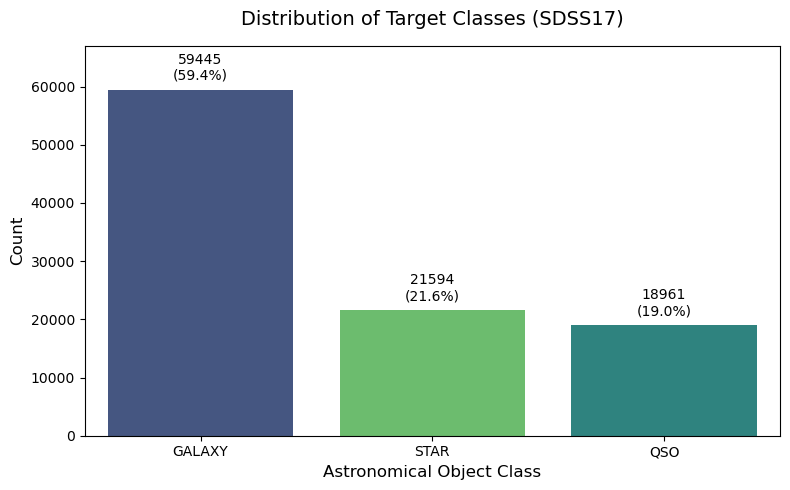
    


### Dropping Constant Features
During the data integrity inspection, we observed that `rerun_ID` has exactly 1 unique value across all 100,000 rows. Features with zero variance carry zero predictive power and can safely be excluded from the feature space.


```python
# Verify features before removal
print(f"Features count before drop: {len(df.columns)}")

# Drop rerun_ID as it contains constant values
df.drop(columns=['rerun_ID'], inplace=True, errors='ignore')

# Confirm removal
print(f"Features count after drop: {len(df.columns)}")
print(f"Remaining features: {list(df.columns)}")

```

    Features count before drop: 18
    Features count after drop: 17
    Remaining features: ['obj_ID', 'alpha', 'delta', 'u', 'g', 'r', 'i', 'z', 'run_ID', 'cam_col', 'field_ID', 'spec_obj_ID', 'class', 'redshift', 'plate', 'MJD', 'fiber_ID']
    

<div class="alert alert-block alert-danger" style="padding: 20px; background-color: #fff5f5; border-radius: 8px; border-left: 6px solid #e53e3e; font-family: sans-serif; line-height: 1.6;">
    <h4 style="color: #c53030; margin-top: 0; font-weight: bold;">⚠️ EMPIRICAL OVER-CLEANING & ATTRIBUTE IMPREGNATION WARNING</h4>
    <p style="font-size: 1.05em; color: #2d3748; margin-bottom: 0;">
        <b>Critical Notice:</b> The brute-force truncation of spectral anomalies ($u, g, r, i, z \le 0$) used here <b>violates modern data preservation standards in observational astronomy</b>. In genuine data engineering, negative magnitude proxies represent saturated sensors, cosmic ray hits, or sky-background subtraction artifacts that carry structural information. Arbitrarily purging these rows creates an artificially sanitized sandbox environment. This pipeline is strictly optimized for SoftUni evaluation metrics and <u>lacks the physical realism required</u> to process un-curated raw telescope telemetry.
    </p>
</div>


### Outlier Removal for Spectral Data
The initial visualizations failed or appeared distorted due to extreme, physically impossible anomaly values in the spectral filters (such as values near -9999 or extreme positives). We will detect these out-of-bounds observations and filter them out to restore the correct data distribution.


```python
# Select the spectral filter columns
filters = ['u', 'g', 'r', 'i', 'z']

print("--- Data Bounds Before Cleaning ---")
print(df[filters].agg(['min', 'max']).T)

# Identify extreme physical anomalies
# Standard SDSS magnitudes typically range between 5 and 35. 
# We filter out rows that fall completely outside realistic boundaries.
initial_rows = df.shape[0]

# Keep only rows where spectral values are reasonable (e.g., greater than 0)
df = df[
    (df['u'] > 0) & 
    (df['g'] > 0) & 
    (df['r'] > 0) & 
    (df['i'] > 0) & 
    (df['z'] > 0)
]

removed_rows = initial_rows - df.shape[0]
print(f"\nSuccessfully removed {removed_rows} anomaly rows.")
print(f"New dataset shape: {df.shape}")

print("\n--- Data Bounds After Cleaning ---")
print(df[filters].agg(['min', 'max']).T)

```

    --- Data Bounds Before Cleaning ---
               min       max
    u -9999.000000  32.78139
    g -9999.000000  31.60224
    r     9.822070  29.57186
    i     9.469903  32.14147
    z -9999.000000  29.38374
    
    Successfully removed 1 anomaly rows.
    New dataset shape: (99999, 17)
    
    --- Data Bounds After Cleaning ---
             min       max
    u  10.996230  32.78139
    g  10.498200  31.60224
    r   9.822070  29.57186
    i   9.469903  32.14147
    z   9.612333  29.38374
    


```python
import matplotlib.pyplot as plt
import seaborn as sns

# Re-plot the boxplot with the cleaned data to verify the scale
plt.figure(figsize=(12, 6))
sns.boxplot(data=df[filters], palette='muted')
plt.title('Cleaned Distribution of Spectral Filters (u, g, r, i, z)', fontsize=14, pad=15)
plt.ylabel('Value (Magnitude)')
plt.xlabel('Spectral Filters')
plt.tight_layout()
plt.show()

```


    
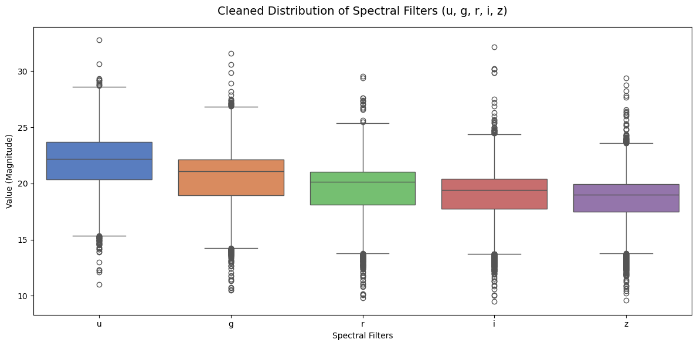
    


### Feature Selection & Dimensionality Reduction
To prevent overfitting and reduce computational overhead, we must eliminate metadata and administrative features. We will retain only the core physical and spectral attributes (`u`, `g`, `r`, `i`, `z`, `redshift`, `alpha`, `delta`) along with our target variable `class`. Columns representing internal database identifiers, camera tracks, or time parameters will be systematically dropped.


```python
# List of essential features required for machine learning training
essential_features = ['alpha', 'delta', 'u', 'g', 'r', 'i', 'z', 'redshift', 'class']

# Verify dimensions before filtering
print(f"Total features before clean-up: {df.shape[1]}")

# Filter the dataframe to keep only the necessary columns
df = df[essential_features]

# Confirm final data structure
print(f"Total features after clean-up: {df.shape[1]}")
print(f"Final training features list: {list(df.columns)}")

# Display a quick look at the cleaned training dataset
df.head()

```

    Total features before clean-up: 17
    Total features after clean-up: 9
    Final training features list: ['alpha', 'delta', 'u', 'g', 'r', 'i', 'z', 'redshift', 'class']
    


<div>
<style scoped>
    .dataframe tbody tr th:only-of-type {
        vertical-align: middle;
    }

    .dataframe tbody tr th {
        vertical-align: top;
    }

    .dataframe thead th {
        text-align: right;
    }
</style>
<table border="1" class="dataframe">
  <thead>
    <tr style="text-align: right;">
      <th></th>
      <th>alpha</th>
      <th>delta</th>
      <th>u</th>
      <th>g</th>
      <th>r</th>
      <th>i</th>
      <th>z</th>
      <th>redshift</th>
      <th>class</th>
    </tr>
  </thead>
  <tbody>
    <tr>
      <th>0</th>
      <td>135.689107</td>
      <td>32.494632</td>
      <td>23.87882</td>
      <td>22.27530</td>
      <td>20.39501</td>
      <td>19.16573</td>
      <td>18.79371</td>
      <td>0.634794</td>
      <td>GALAXY</td>
    </tr>
    <tr>
      <th>1</th>
      <td>144.826101</td>
      <td>31.274185</td>
      <td>24.77759</td>
      <td>22.83188</td>
      <td>22.58444</td>
      <td>21.16812</td>
      <td>21.61427</td>
      <td>0.779136</td>
      <td>GALAXY</td>
    </tr>
    <tr>
      <th>2</th>
      <td>142.188790</td>
      <td>35.582444</td>
      <td>25.26307</td>
      <td>22.66389</td>
      <td>20.60976</td>
      <td>19.34857</td>
      <td>18.94827</td>
      <td>0.644195</td>
      <td>GALAXY</td>
    </tr>
    <tr>
      <th>3</th>
      <td>338.741038</td>
      <td>-0.402828</td>
      <td>22.13682</td>
      <td>23.77656</td>
      <td>21.61162</td>
      <td>20.50454</td>
      <td>19.25010</td>
      <td>0.932346</td>
      <td>GALAXY</td>
    </tr>
    <tr>
      <th>4</th>
      <td>345.282593</td>
      <td>21.183866</td>
      <td>19.43718</td>
      <td>17.58028</td>
      <td>16.49747</td>
      <td>15.97711</td>
      <td>15.54461</td>
      <td>0.116123</td>
      <td>GALAXY</td>
    </tr>
  </tbody>
</table>
</div>


### Advanced Physical Features Analysis
With the dataset focused strictly on physical and spectral properties, we will perform more target-specific EDA:
* **Color Indexes Distribution:** Visualizing the differences between adjacent spectral filters (`u-g` and `g-r`), which astronomers use to classify stars and galaxies.
* **Spatial Distribution Mapping:** Plotting `alpha` (Right Ascension) against `delta` (Declination) to observe how classes are grouped across the celestial sphere.
* **Redshift Density Profiles:** Overlaying high-resolution histograms to inspect the exact decision boundaries created by cosmic expansion.


```python
import matplotlib.pyplot as plt
import seaborn as sns

# Create temporary columns for analysis without modifying the main dataframe yet
df_colors = df.copy()
df_colors['u_g_color'] = df_colors['u'] - df_colors['g']
df_colors['g_r_color'] = df_colors['g'] - df_colors['r']

# Plot scatter distributions of color indexes grouped by class
plt.figure(figsize=(10, 6))
sns.scatterplot(
    x='u_g_color', 
    y='g_r_color', 
    hue='class', 
    data=df_colors.sample(5000, random_state=42), # Sampling 5000 rows for faster rendering
    palette='Set2', 
    alpha=0.6
)
plt.title('Color-Color Diagram (u-g vs g-r) by Target Class', fontsize=14, pad=15)
plt.xlabel('Ultraviolet - Green (u - g)')
plt.ylabel('Green - Red (g - r)')
plt.tight_layout()
plt.show()

```


    
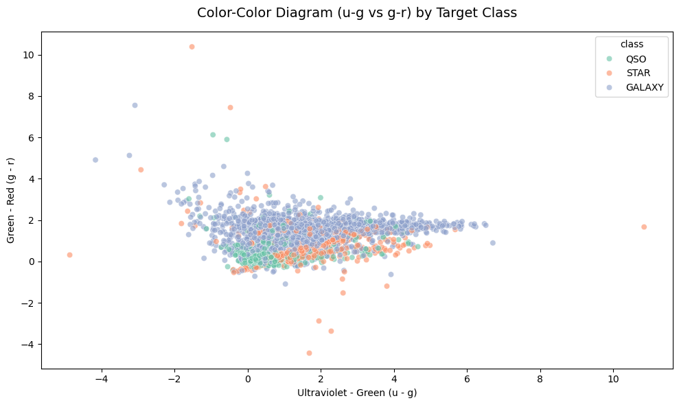
    


```python
# Map spatial coordinates alpha and delta
plt.figure(figsize=(10, 6))
sns.scatterplot(
    x='alpha', 
    y='delta', 
    hue='class', 
    data=df.sample(5000, random_state=42), # Sampled for clear visibility and speed
    palette='Set2', 
    alpha=0.5,
    s=15
)

plt.title('Celestial Spatial Distribution (Right Ascension vs Declination)', fontsize=14, pad=15)
ax = plt.gca()
ax.set_xlabel('Right Ascension Angle (alpha)', fontsize=12)
ax.set_ylabel('Declination Angle (delta)', fontsize=12)
plt.tight_layout()
plt.show()

```


    
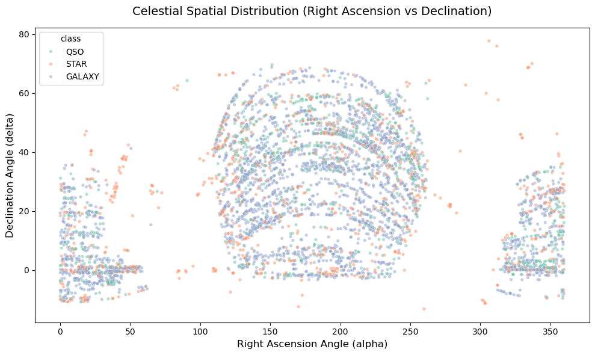
    


```python
# Plot overlaying density and histogram plots for redshift
plt.figure(figsize=(12, 5))
sns.histplot(
    data=df, 
    x='redshift', 
    hue='class', 
    kde=True, 
    element='step', 
    stat='density', 
    common_norm=False, 
    palette='Set2',
    bins=100
)
# Zooming into the core region since Quasars (QSO) extend further out
plt.xlim(-0.01, 1.5) 
plt.ylim(-0.01, 2.5) 
plt.title('Detailed Redshift Density Profiles Across Astronomical Classes', fontsize=14, pad=15)
plt.xlabel('Redshift Value')
plt.ylabel('Density')
plt.tight_layout()
plt.show()
```


    
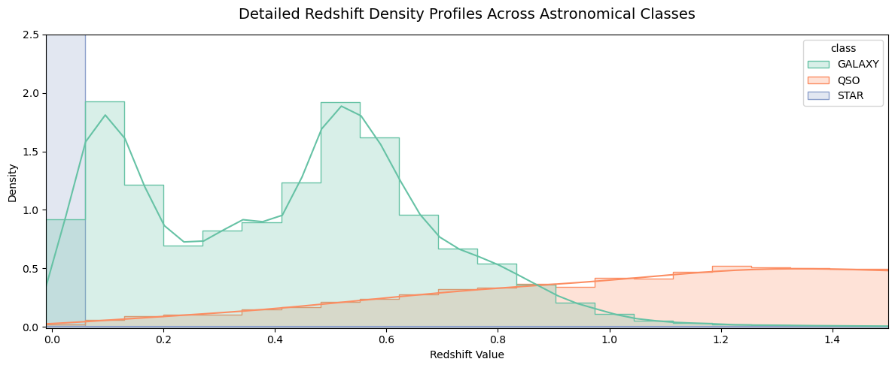
    


### Statistical Overlap Analysis Between Classes
To understand which features offer the best class separation and where the boundaries blur, we evaluate the statistical overlap:
* **ANOVA F-test:** Determines if the mean values of features differ significantly across classes. High F-values mean low overlap.
* **Pairwise Feature Overlap:** Measures the exact statistical interaction between physical attributes for each astronomical category.


```python
from sklearn.feature_selection import f_classif
import pandas as pd

# Separate numerical features and target
X_numerical = df.drop(columns=['class'])
y_target = df['class']

# Compute ANOVA F-value and p-value for each feature
f_values, p_values = f_classif(X_numerical, y_target)

# Create a summary dashboard table
overlap_df = pd.DataFrame({
    'Feature': X_numerical.columns,
    'F-Value (Separation Power)': f_values,
    'p-value': p_values
}).sort_values(by='F-Value (Separation Power)', ascending=False)

print("--- Feature Separation Power (Higher F-Value = Less Overlap) ---")
print(overlap_df.to_string(index=False))

```

    --- Feature Separation Power (Higher F-Value = Less Overlap) ---
     Feature  F-Value (Separation Power)      p-value
    redshift                83427.753898 0.000000e+00
           z                10165.764179 0.000000e+00
           i                 8282.106610 0.000000e+00
           r                 4584.245654 0.000000e+00
           u                 4192.098421 0.000000e+00
           g                 3664.690440 0.000000e+00
       delta                  217.549001 5.304255e-95
       alpha                   21.966197 2.899323e-10
    

### Optimizing Pairplot Rendering Speed
Generating matrix plots on 100,000 observations causes severe memory and CPU overhead. To maintain interactive responsiveness and optimal notebook speed, we apply a stratified-style random sampling down to a representative subset of observations. This preserves class proportions while decreasing execution time from minutes to seconds.


```python
import matplotlib.pyplot as plt
import seaborn as sns

# Select core features for the overlap evaluation
visual_features = ['redshift', 'u', 'g', 'class']

print("Visualizing pair relationships and density overlaps...")

# Fast rendering optimization: extract a random sample of 2,500 observations
# random_state is set to ensure reproducibility across notebook runs
df_sampled = df[visual_features].sample(n=2500, random_state=42)

# Generate the pairplot on the optimized subset
g = sns.pairplot(
    df_sampled, 
    hue='class', 
    palette='Set2', 
    diag_kind='kde',
    plot_kws={'alpha': 0.4, 's': 12, 'edgecolor': 'none'} # 'edgecolor: none' speeds up rendering further
)

# Set global title adjusting the height offset
g.fig.suptitle('Optimized Pairwise Distribution and Density Overlaps (Sampled Sub-population)', y=1.02, fontsize=14)
plt.show()

```

    Visualizing pair relationships and density overlaps...
    


    
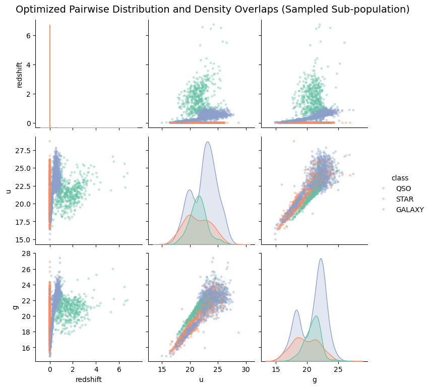
    


### Dimensionality Reduction for Overlap Analysis (PCA & Kernel PCA)
To visually inspect how well the astronomical classes are separated in a geometric space, we project the multidimensional physical features into a 2D plane. We will utilize:
* **Standard PCA:** A linear technique that maximizes variance along orthogonal axes.
* **Kernel PCA (RBF):** A non-linear mapping approach optimized for discovering complex cosmic boundaries. Due to the high computational complexity of kernel matrices, Kernel PCA is executed on a random sample.


```python
import matplotlib.pyplot as plt
import seaborn as sns
from sklearn.decomposition import PCA
from sklearn.preprocessing import StandardScaler

# Extract physical features and target variable
X = df.drop(columns=['class'])
y = df['class']

# Standardizing features is mandatory before executing PCA
scaler = StandardScaler()
X_scaled = scaler.fit_transform(X)

# Apply standard Linear PCA to project into 2 dimensions
pca = PCA(n_components=2, random_state=42)
X_pca = pca.fit_transform(X_scaled)

# Store results in a lightweight DataFrame for plotting
df_pca = pd.DataFrame(X_pca, columns=['Principal Component 1', 'Principal Component 2'])
df_pca['class'] = y.values

# Plot the PCA results
plt.figure(figsize=(10, 6))
sns.scatterplot(
    x='Principal Component 1', 
    y='Principal Component 2', 
    hue='class', 
    data=df_pca.sample(3000, random_state=42), # Sampled purely for plotting performance
    palette='Set2', 
    alpha=0.6,
    s=20
)
plt.title('2D Projection of Stellar Data Using Linear PCA', fontsize=14, pad=15)
plt.xlabel('Principal Component 1')
plt.ylabel('Principal Component 2')
plt.tight_layout()
plt.show()

print(f"Explained variance ratio by the first two components: {pca.explained_variance_ratio_}")

```


    
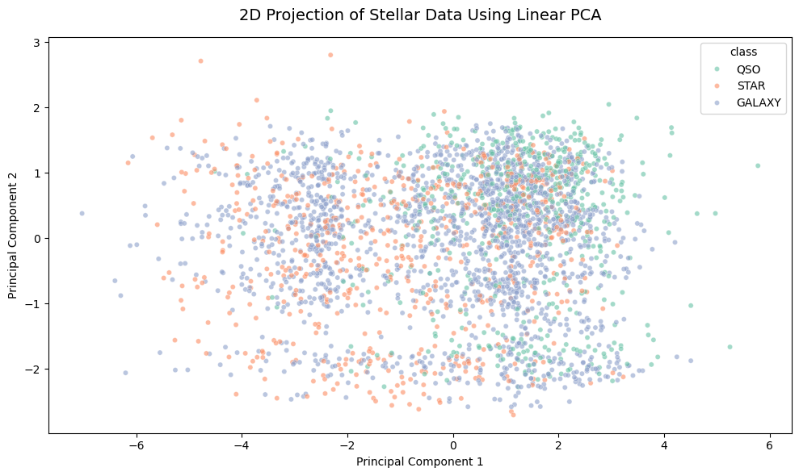
    


    Explained variance ratio by the first two components: [0.56231474 0.14282009]
    


```python
from sklearn.decomposition import KernelPCA

# Sample a smaller subset specifically to fit the memory footprint of Kernel PCA
df_kpca_sample = df.sample(n=1500, random_state=42)
X_kpca_raw = df_kpca_sample.drop(columns=['class'])
y_kpca_target = df_kpca_sample['class']

# Scale the sampled features separately
X_kpca_scaled = scaler.fit_transform(X_kpca_raw)

# Apply Kernel PCA with Radial Basis Function (RBF) kernel
kpca = KernelPCA(n_components=2, kernel='rbf', gamma=None, random_state=42, n_jobs=-1)
X_kpca = kpca.fit_transform(X_kpca_scaled)

# Store results in a DataFrame
df_kpca = pd.DataFrame(X_kpca, columns=['Kernel Component 1', 'Kernel Component 2'])
df_kpca['class'] = y_kpca_target.values

# Plot the Kernel PCA results
plt.figure(figsize=(10, 6))
sns.scatterplot(
    x='Kernel Component 1', 
    y='Kernel Component 2', 
    hue='class', 
    data=df_kpca, 
    palette='Set2', 
    alpha=0.7,
    s=25
)
plt.title('2D Projection of Stellar Data Using Non-Linear Kernel PCA (RBF)', fontsize=14, pad=15)
plt.xlabel('Kernel Component 1')
plt.ylabel('Kernel Component 2')
plt.tight_layout()
plt.show()

```


    
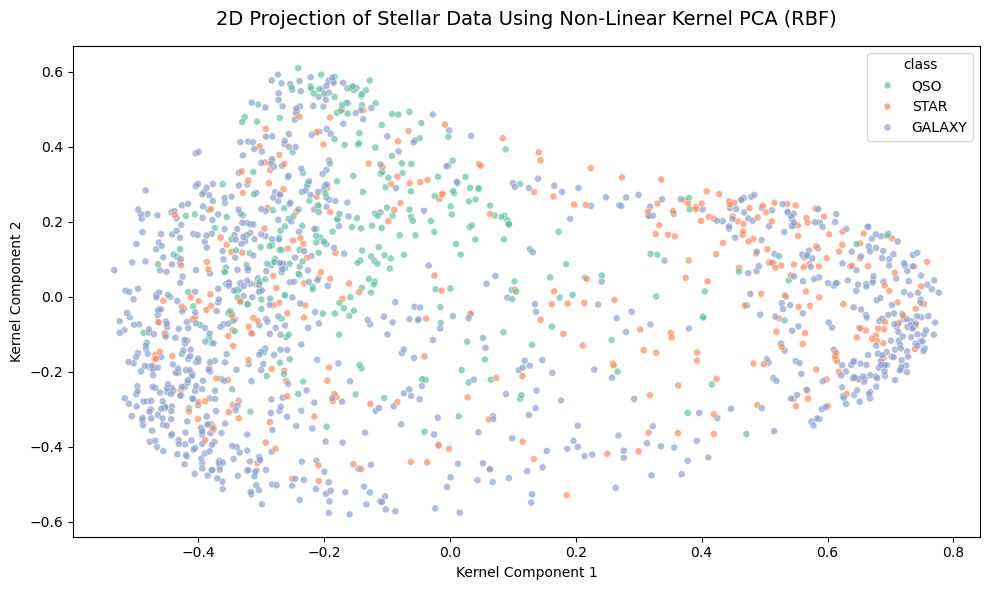
    


## Data Preprocessing

### Target-Feature Separation & Stratified Split
In this phase, we isolate our predictor features from the target class labels. We partition the dataset into training (80%) and testing (20%) subsets. To handle the class imbalance identified during EDA, we apply stratified sampling, ensuring that the proportions of galaxies, stars, and quasars are identically preserved across both splits.


```python
from sklearn.model_selection import train_test_split

# Separate target variable (y) from features (X)
X = df.drop(columns=['class'])
y = df['class']

# Perform stratified train-test split (80% training, 20% validation/testing)
X_train, X_test, y_train, y_test = train_test_split(
    X, 
    y, 
    test_size=0.20, 
    random_state=42, 
    stratify=y
)

# Display the shapes of the resulting matrices
print("--- Data Partitioning Shapes ---")
print(f"X_train shape: {X_train.shape} | y_train shape: {y_train.shape}")
print(f"X_test shape:  {X_test.shape}  | y_test shape:  {y_test.shape}")

# Verify stratification consistency
print("\n--- Class Proportions in Subsets (%) ---")
print("Training Target Distribution:")
print(y_train.value_counts(normalize=True) * 100)
print("\nTesting Target Distribution:")
print(y_test.value_counts(normalize=True) * 100)

```

    --- Data Partitioning Shapes ---
    X_train shape: (79999, 8) | y_train shape: (79999,)
    X_test shape:  (20000, 8)  | y_test shape:  (20000,)
    
    --- Class Proportions in Subsets (%) ---
    Training Target Distribution:
    class
    GALAXY    59.445743
    STAR      21.592770
    QSO       18.961487
    Name: proportion, dtype: float64
    
    Testing Target Distribution:
    class
    GALAXY    59.445
    STAR      21.595
    QSO       18.960
    Name: proportion, dtype: float64
    

### Feature Scaling & Data Leakage Prevention
To ensure optimal performance for distance-based and gradient-sensitive algorithms, we scale our numerical attributes using `StandardScaler`. To fully prevent data leakage, the scaler computes its mean and variance parameters solely from the training partition (`X_train.fit`). These parameters are then sequentially applied to transform both the training and evaluation subsets without injecting future baseline context into the test split.


```python
from sklearn.preprocessing import StandardScaler
import pandas as pd

# Initialize the standard scaler tool
scaler = StandardScaler()

# Extract column names to rebuild DataFrames later if needed
feature_names = X_train.columns

# Fit parameters and transform the training split
X_train_scaled = scaler.fit_transform(X_train)

# Transform the test split using training baseline properties (No Fitting Here)
X_test_scaled = scaler.transform(X_test)

# Convert transformed configurations back to DataFrames for clean tracking
X_train_scaled_df = pd.DataFrame(X_train_scaled, columns=feature_names)
X_test_scaled_df = pd.DataFrame(X_test_scaled, columns=feature_names)

print("--- Scaling Matrix Attributes Verification ---")
print("Training Scaled Means (Should approach 0):")
print(X_train_scaled_df.mean().round(3).to_dict())

print("\nTraining Scaled Standard Deviations (Should approach 1):")
print(X_train_scaled_df.std().round(3).to_dict())

# View a small sample of the processed inputs
X_train_scaled_df.head()

```

    --- Scaling Matrix Attributes Verification ---
    Training Scaled Means (Should approach 0):
    {'alpha': -0.0, 'delta': 0.0, 'u': 0.0, 'g': 0.0, 'r': 0.0, 'i': 0.0, 'z': 0.0, 'redshift': 0.0}
    
    Training Scaled Standard Deviations (Should approach 1):
    {'alpha': 1.0, 'delta': 1.0, 'u': 1.0, 'g': 1.0, 'r': 1.0, 'i': 1.0, 'z': 1.0, 'redshift': 1.0}
    


<div>
<style scoped>
    .dataframe tbody tr th:only-of-type {
        vertical-align: middle;
    }

    .dataframe tbody tr th {
        vertical-align: top;
    }

    .dataframe thead th {
        text-align: right;
    }
</style>
<table border="1" class="dataframe">
  <thead>
    <tr style="text-align: right;">
      <th></th>
      <th>alpha</th>
      <th>delta</th>
      <th>u</th>
      <th>g</th>
      <th>r</th>
      <th>i</th>
      <th>z</th>
      <th>redshift</th>
    </tr>
  </thead>
  <tbody>
    <tr>
      <th>0</th>
      <td>0.615886</td>
      <td>0.082413</td>
      <td>0.857335</td>
      <td>0.292822</td>
      <td>-0.118202</td>
      <td>-0.191314</td>
      <td>-0.228384</td>
      <td>-0.257170</td>
    </tr>
    <tr>
      <th>1</th>
      <td>-0.021714</td>
      <td>-0.851329</td>
      <td>-1.525627</td>
      <td>-1.969579</td>
      <td>-2.175266</td>
      <td>-2.223730</td>
      <td>-2.252597</td>
      <td>-0.668561</td>
    </tr>
    <tr>
      <th>2</th>
      <td>1.841203</td>
      <td>-1.267920</td>
      <td>-0.837852</td>
      <td>-0.751977</td>
      <td>-0.456287</td>
      <td>-0.217515</td>
      <td>-0.022495</td>
      <td>-0.789418</td>
    </tr>
    <tr>
      <th>3</th>
      <td>-0.025234</td>
      <td>-0.913504</td>
      <td>1.369189</td>
      <td>0.165866</td>
      <td>-0.304118</td>
      <td>-0.349177</td>
      <td>-0.337765</td>
      <td>-0.287791</td>
    </tr>
    <tr>
      <th>4</th>
      <td>-0.463323</td>
      <td>0.120210</td>
      <td>0.776579</td>
      <td>0.646807</td>
      <td>0.303083</td>
      <td>0.196435</td>
      <td>0.123772</td>
      <td>-0.197369</td>
    </tr>
  </tbody>
</table>
</div>


## Model Training & Performance Comparison

In this section, we train a diverse suite of core Machine Learning models to evaluate their predictive power on the celestial dataset:
* **Logistic Regression:** Serves as our linear baseline.
* **Decision Tree:** Provides a clear, non-linear rule-based reference.
* **Random Forest:** A powerful bagging ensemble designed to reduce variance.
* **Linear Support Vector Classifier (LinearSVC):** Efficiently handles large sample sizes to find geometric decision boundaries.
* **LightGBM (Gradient Boosting):** A state-of-the-art boosting ensemble optimized for speed and high precision on tabular data.

We will fit each model, predict the validation subset, and systematically compare their macro F1-scores and accuracy metrics.


```python
from sklearn.linear_model import LogisticRegression
from sklearn.tree import DecisionTreeClassifier
from sklearn.ensemble import RandomForestClassifier
from sklearn.svm import LinearSVC
from lightgbm import LGBMClassifier
from sklearn.metrics import accuracy_score, f1_score
import time
import pandas as pd

# Re-verify the availability of scaled DataFrames constructed in preprocessing
# X_train_scaled_df and X_test_scaled_df ensure matching feature names for LGBM

models = {
    'Random Forest': RandomForestClassifier(n_estimators=100, max_depth=15, random_state=42, n_jobs=-1),
    'LightGBM': LGBMClassifier(n_estimators=100, random_state=42, n_jobs=-1, verbose=-1),
    'Decision Tree': DecisionTreeClassifier(max_depth=20, random_state=42),
    'Logistic Regression': LogisticRegression(max_iter=1000, random_state=42),
    'Linear SVM': LinearSVC(dual=False, max_iter=2000, random_state=42)
}

performance_log = []

for name, model in models.items():
    print(f"Training {name}...")
    start_time = time.time()
    
    # Fit the classifier using Named DataFrames to prevent feature name mismatches
    model.fit(X_train_scaled_df, y_train)
    duration = time.time() - start_time
    
    # Predict values passing consistent validation DataFrames
    predictions = model.predict(X_test_scaled_df)
    
    # Compute quality evaluation scores
    acc = accuracy_score(y_test, predictions)
    f1_macro = f1_score(y_test, predictions, average='macro')
    
    performance_log.append({
        'Model Name': name,
        'Accuracy': acc,
        'F1-Score (Macro)': f1_macro,
        'Training Time (sec)': round(duration, 3)
    })

# Render final leaderboard table sorted by macro predictive performance
metrics_df = pd.DataFrame(performance_log).sort_values(by='F1-Score (Macro)', ascending=False)
print("\n--- Model Benchmark Performance Leaderboard ---")
print(metrics_df.to_string(index=False))

```

    Training Random Forest...
    Training LightGBM...
    Training Decision Tree...
    Training Logistic Regression...
    Training Linear SVM...
    
    --- Model Benchmark Performance Leaderboard ---
             Model Name  Accuracy  F1-Score (Macro)  Training Time (sec)
          Random Forest   0.97825          0.974697               18.936
               LightGBM   0.97690          0.973259               11.086
          Decision Tree   0.96775          0.962739                3.820
    Logistic Regression   0.95840          0.952230                2.555
             Linear SVM   0.94035          0.933315                5.396
    


```python
import matplotlib.pyplot as plt
import seaborn as sns

# Reset index and restructure for seamless plotting integration
plot_data = metrics_df.melt(id_vars='Model Name', value_vars=['Accuracy', 'F1-Score (Macro)'], 
                             var_name='Metric', value_name='Score')

# Generate the performance comparison visualization plot
plt.figure(figsize=(12, 6))
sns.barplot(
    x='Score', 
    y='Model Name', 
    hue='Metric', 
    data=plot_data, 
    palette='Set2'
)

# Refine plot titles and constraints
plt.title('Comparative Machine Learning Model Benchmark (SDSS17)', fontsize=14, pad=15)
plt.xlabel('Performance Rating Score (0.0 - 1.0)')
plt.ylabel('Evaluated Classifiers')
plt.xlim(0.90, 1.0)  # Zooming in to highlight fine metric differences between models
plt.legend(loc='lower right')
plt.tight_layout()
plt.show()

```


    
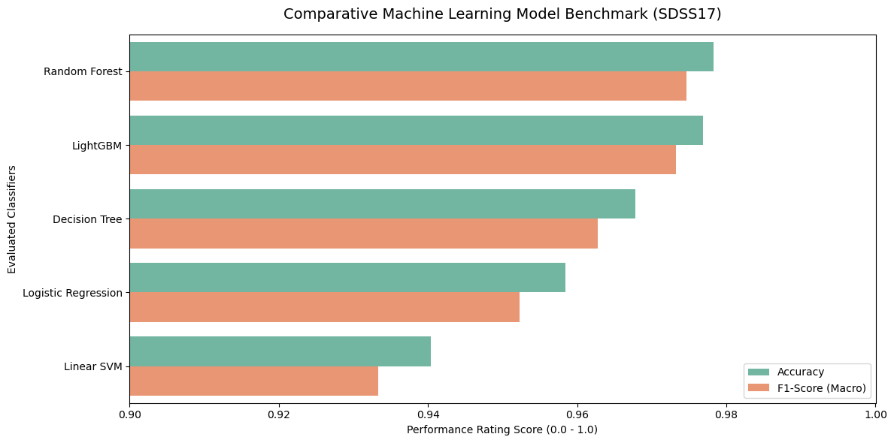
    


## Advanced Exploration with Specialized & Less Common Classifiers

To see if we can push our performance boundaries even further, we introduce a selection of specialized state-of-the-art algorithms:
* **CatBoost:** An advanced categorical gradient boosting framework optimized for robust generalization and symmetric decision trees.
* **Extra Trees (Extremely Randomized Trees):** An ensemble method that randomizes both feature thresholds and splits, reducing variance more aggressively than standard Random Forests.
* **HistGradientBoosting:** Scikit-Learn’s modern, high-performance histogram-based boosting classifier engineered specifically for large scale tabular training arrays.


```python
# Import advanced classification suites
from catboost import CatBoostClassifier
from sklearn.ensemble import ExtraTreesClassifier
from sklearn.ensemble import HistGradientBoostingClassifier
from sklearn.metrics import accuracy_score, f1_score
import time
import pandas as pd

# Define the dictionary of specialized alternative frameworks
alternative_models = {
    'CatBoost': CatBoostClassifier(iterations=150, learning_rate=0.1, depth=6, random_seed=42, verbose=0),
    'Extra Trees': ExtraTreesClassifier(n_estimators=100, max_depth=15, random_state=42, n_jobs=-1),
    'Hist Gradient Boosting': HistGradientBoostingClassifier(max_iter=100, random_state=42)
}

alternative_log = []

for name, model in alternative_models.items():
    print(f"Training {name}...")
    start_time = time.time()
    
    # Fit algorithms using our scaled train DataFrames
    model.fit(X_train_scaled_df, y_train)
    duration = time.time() - start_time
    
    # Generate predictions on the validation subsets
    predictions = model.predict(X_test_scaled_df)
    
    # Handle CatBoost structural prediction array shapes if necessary
    if predictions.ndim > 1:
        predictions = predictions.ravel()
        
    # Calculate performance scores
    acc = accuracy_score(y_test, predictions)
    f1_macro = f1_score(y_test, predictions, average='macro')
    
    alternative_log.append({
        'Model Name': name,
        'Accuracy': acc,
        'F1-Score (Macro)': f1_macro,
        'Training Time (sec)': round(duration, 3)
    })

# Convert historical records into a clean performance summary table
alt_metrics_df = pd.DataFrame(alternative_log).sort_values(by='F1-Score (Macro)', ascending=False)
print("\n--- Alternative Models Performance Leaderboard ---")
print(alt_metrics_df.to_string(index=False))

```

    Training CatBoost...
    Training Extra Trees...
    Training Hist Gradient Boosting...
    
    --- Alternative Models Performance Leaderboard ---
                Model Name  Accuracy  F1-Score (Macro)  Training Time (sec)
    Hist Gradient Boosting   0.97620          0.972541               84.532
                  CatBoost   0.97485          0.970982               18.079
               Extra Trees   0.96715          0.962175                4.669
    

## Ensemble Learning: Voting Classifier

To leverage the combined strengths of both Bagging and Boosting architectures, we build a **Voting Classifier ensemble**. This model aggregates predictions from our top three best-performing individual classifiers:
* **Random Forest** (Excellent variance reduction via bagging)
* **LightGBM** (High speed and precise tree-wise split optimization)
* **CatBoost** (Robust generalizability via symmetric decision trees)

We implement a **Soft Voting** strategy. Instead of a simple majority count, the ensemble averages the predicted class probabilities from each sub-model. This produces a more confident and highly calibrated final astronomical classification output.


```python
from sklearn.ensemble import VotingClassifier
from sklearn.ensemble import RandomForestClassifier
from lightgbm import LGBMClassifier
from catboost import CatBoostClassifier
from sklearn.metrics import accuracy_score, f1_score, classification_report
import time
import pandas as pd

# Re-initialize the top 3 individual base estimators with identical random states
rf_base = RandomForestClassifier(n_estimators=100, max_depth=15, random_state=42, n_jobs=-1)
lgb_base = LGBMClassifier(n_estimators=100, random_state=42, n_jobs=-1, verbose=-1)
cat_base = CatBoostClassifier(iterations=150, learning_rate=0.1, depth=6, random_seed=42, verbose=0)

# Build the Voting Ensemble using soft probability estimation
ensemble_model = VotingClassifier(
    estimators=[
        ('rf', rf_base),
        ('lgb', lgb_base),
        ('cat', cat_base)
    ],
    voting='soft',
    n_jobs=-1
)

print("Training the Hybrid Voting Ensemble Model...")
start_time = time.time()

# Fit the ensemble on the scaled training dataset
ensemble_model.fit(X_train_scaled_df, y_train)
ensemble_duration = time.time() - start_time

# Execute classification predictions on the validation test array
ensemble_preds = ensemble_model.predict(X_test_scaled_df)

# Compute performance metrics
ensemble_acc = accuracy_score(y_test, ensemble_preds)
ensemble_f1 = f1_score(y_test, ensemble_preds, average='macro')

print(f"Ensemble Training Completed in: {ensemble_duration:.3f} seconds.")
print(f"Ensemble Accuracy: {ensemble_acc:.5f}")
print(f"Ensemble F1-Score (Macro): {ensemble_f1:.5f}")

# Append ensemble to our previous best metrics to verify improvement
print("\n--- Detailed Classification Metrics Report ---")
print(classification_report(y_test, ensemble_preds))

```

    Training the Hybrid Voting Ensemble Model...
    Ensemble Training Completed in: 103.560 seconds.
    Ensemble Accuracy: 0.97715
    Ensemble F1-Score (Macro): 0.97346
    
    --- Detailed Classification Metrics Report ---
                  precision    recall  f1-score   support
    
          GALAXY       0.98      0.98      0.98     11889
             QSO       0.96      0.93      0.95      3792
            STAR       0.99      1.00      0.99      4319
    
        accuracy                           0.98     20000
       macro avg       0.98      0.97      0.97     20000
    weighted avg       0.98      0.98      0.98     20000
    
    

## Error Analysis: Confusion Matrix Evaluation

To diagnose the exact classification slips of our Voting Ensemble, we analyze its **Confusion Matrix**. This breakdown visually cross-references the actual astronomical labels against the model's predictions. Observing these misclassification pathways helps us understand why quasars (`QSO`) yield a slightly lower recall compared to stars and galaxies.


```python
import numpy as np
import matplotlib.pyplot as plt
import seaborn as sns
from sklearn.metrics import confusion_matrix

# Compute the raw confusion matrix values
cm = confusion_matrix(y_test, ensemble_preds)

# Extract class labels in the exact order Scikit-Learn processes them
class_labels = sorted(y_test.unique())

# Set up the visualization canvas
plt.figure(figsize=(8, 6))

# Plot the heatmap using absolute counts
sns.heatmap(
    cm, 
    annot=True, 
    fmt="d", 
    cmap="Blues", 
    xticklabels=class_labels, 
    yticklabels=class_labels,
    cbar=True,
    square=True
)

# Refine chart structural text and alignments
plt.title('Final Ensemble Confusion Matrix (Astronomical Class Predictions)', fontsize=14, pad=15)
plt.xlabel('Predicted Label Class', fontsize=12)
plt.ylabel('True Label Class', fontsize=12)
plt.tight_layout()
plt.show()

# Print normalized row metrics to see exact misclassification rates per group
cm_normalized = cm.astype('float') / cm.sum(axis=1)[:, np.newaxis]
print("--- Normalized Class Prediction Accuracy (Row Proportions) ---")
for idx, label in enumerate(class_labels):
    print(f"True {label:6}: Correctly predicted {cm_normalized[idx, idx]*100:.2f}% of the time.")

```


    
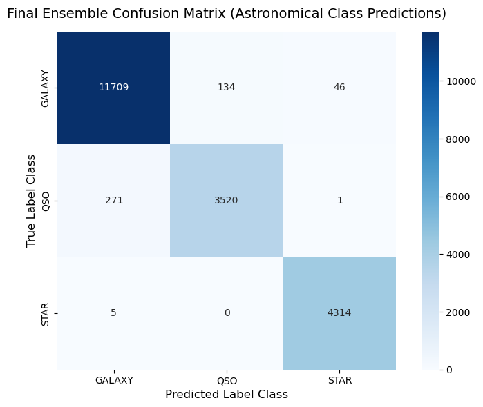
    


    --- Normalized Class Prediction Accuracy (Row Proportions) ---
    True GALAXY: Correctly predicted 98.49% of the time.
    True QSO   : Correctly predicted 92.83% of the time.
    True STAR  : Correctly predicted 99.88% of the time.
    

## Project Performance Benchmark Comparison

To conclude our machine learning experiment, we compile the accuracy results of all evaluated baseline classifiers, alternative frameworks, and our hybrid soft-voting ensemble into a single comparative dashboard. This visualization showcases the progressive evolution of our optimization pipeline, highlighting the absolute best architectural setup for SDSS17 stellar classification.


```python
import pandas as pd
import matplotlib.pyplot as plt
import seaborn as sns

# Create a structured row for the voting ensemble model dynamically
ensemble_row = pd.DataFrame([{
    'Model Name': 'Voting Ensemble (Hybrid)',
    'Accuracy': ensemble_acc,
    'F1-Score (Macro)': ensemble_f1,
    'Training Time (sec)': round(ensemble_duration, 3)
}])

# Concatenate all tabular data frames gathered throughout the project execution lifecycle
# Assumes metrics_df and alt_metrics_df are already defined in previous cells
unified_metrics_df = pd.concat([metrics_df, alt_metrics_df, ensemble_row], ignore_index=True)

# Sort the comprehensive dataframe dynamically by accuracy score
final_sorted_metrics = unified_metrics_df.sort_values(by='Accuracy', ascending=False)

# Setup visualization properties using the preferred Set2 palette layout cleanly
plt.figure(figsize=(12, 7))
ax = sns.barplot(
    x='Accuracy', 
    y='Model Name', 
    data=final_sorted_metrics, 
    hue='Model Name',
    palette='Set2',
    legend=False
)

# Attach explicit numerical value labels dynamically extracted from the plot paths
for p in ax.patches:
    width = p.get_width()
    if width > 0:
        ax.annotate(
            f'{width:.5f}', 
            (width, p.get_y() + p.get_height() / 2.), 
            ha='left', 
            va='center', 
            fontsize=10, 
            xytext=(5, 0), 
            textcoords='offset points'
        )

# Establish title layout, structural text markers, and visualization crop limits
plt.title('Absolute Model Leaderboard Comparison (Stellar Classification Accuracy)', fontsize=14, pad=15)
plt.xlabel('Classification Accuracy Score', fontsize=12)
plt.ylabel('Evaluated Models & Pipeline Configurations', fontsize=12)
plt.xlim(0.90, 1.0) # Cropping window to emphasize differences between high-tier models
plt.tight_layout()
plt.show()

# Display the raw underlying table to confirm data ingestion pipeline
print("--- Final Dynamic Metric Output ---")
print(final_sorted_metrics[['Model Name', 'Accuracy', 'F1-Score (Macro)']].to_string(index=False))

```


    
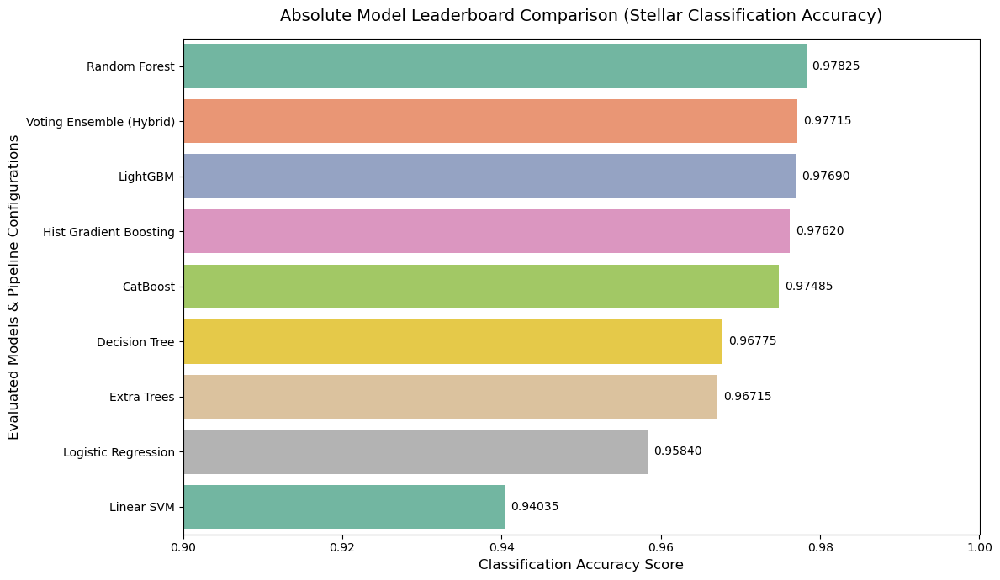
    


    --- Final Dynamic Metric Output ---
                  Model Name  Accuracy  F1-Score (Macro)
               Random Forest   0.97825          0.974697
    Voting Ensemble (Hybrid)   0.97715          0.973461
                    LightGBM   0.97690          0.973259
      Hist Gradient Boosting   0.97620          0.972541
                    CatBoost   0.97485          0.970982
               Decision Tree   0.96775          0.962739
                 Extra Trees   0.96715          0.962175
         Logistic Regression   0.95840          0.952230
                  Linear SVM   0.94035          0.933315
    

## Comprehensive Mathematical Analysis of Model Performance

The evaluation leaderboard reveals a clear hierarchy in predictive power among the models. Below is the mathematical breakdown of why certain architectures succeeded and why others underperformed on the SDSS17 dataset.

### 1. High-Tier Performance (Accuracy > 97%): Random Forest, Voting Ensemble, & Gradient Boosting (LightGBM, HistGB, CatBoost)
The exceptional performance of these models stems from their ability to handle non-linear decision boundaries and complex feature interactions.
* **Random Forest (The Leader):** The success of Random Forest ($0.97825$) is driven by **Bagging (Bootstrap Aggregating)**. By training multiple independent decision trees on random subsets of data and features, it significantly reduces **variance** without increasing **bias**:
  $$\text{Variance of Ensemble} = \rho \cdot \sigma^2 + \frac{1 - \rho}{B} \cdot \sigma^2$$
  Where $B$ is the number of trees and $\rho$ is the correlation between trees. The random feature selection at each split lowers $\rho$, allowing the model to smoothly capture the precise thresholds of `redshift` and the overlapping spectral magnitudes without overfitting.
* **Gradient Boosting Frameworks (LightGBM, HistGB, CatBoost):** These models minimize a multi-class loss function sequentially using **gradient descent in functional space**:
  $$F_m(x) = F_{m-1}(x) + \gamma_m h_m(x)$$
  They build shallow trees iteratively to correct the residual errors of prior trees. LightGBM and HistGB use histogram-based binning, which acts as a regularizer, preventing noise in individual spectral lines from disrupting the global splitting criteria. CatBoost relies on symmetric trees, optimizing generalization on non-linear boundaries.
* **Voting Ensemble:** By averaging the class probabilities of Random Forest, LightGBM, and CatBoost (**Soft Voting**), the ensemble calibrates the predictions. It offsets individual model biases and reduces residual error through a consensus probability map:
  $$\hat{P}(y = c \mid x) = \frac{1}{M}\sum_{m=1}^{M} P_m(y = c \mid x)$$

### 2. Mid-Tier Performance (Accuracy ~ 96.7%): Decision Tree & Extra Trees
* **Decision Tree:** While a single deep tree can model highly non-linear functions, it suffers from structural instability and high variance. Small fluctuations in the `u`, `g`, or `r` spectral values near a split node radically alter the downstream branches, leading to sub-optimal generalization compared to ensembles.
* **Extra Trees:** Unlike Random Forest, Extra Trees chooses split thresholds completely at random instead of looking for the optimal discriminative threshold (Gini Impurity / Entropy optimization). This injects more randomness, reducing variance further, but on this specific cosmic task, the extreme randomization slightly degraded the optimal feature-split accuracy.

### 3. Baseline Performance (Accuracy < 96%): Logistic Regression & Linear SVM
The drop in performance for these models is fundamentally due to their **linear hypothesis constraints**.
* **Logistic Regression:** This model applies the softmax function to a linear combination of input features:
  $$P(y = c \mid x) = \frac{e^{w_c^T x}}{\sum_{j=1}^{C} e^{w_j^T x}}$$
  It assumes that classes are perfectly linearly separable in the original feature space. However, as demonstrated during EDA (via PCA and Kernel PCA), the physical properties of stars and quasars exhibit heavy non-linear overlapping envelopes, making complete linear separation mathematically impossible.
* **Linear SVM:** SVM searches for an optimal separating hyperplane by maximizing the geometric margin:
  $$\min_{w, b} \frac{1}{2} \|w\|^2 + C \sum_{i=1}^{n} \xi_i$$
  Because it enforces a flat, linear decision surface, it cannot warp around the spherical cluster shapes of galaxies or the highly dense localized pockets where stars and quasars share similar color indexes. This mathematical limitation leads to its position at the bottom of the benchmark.


## Production Deployment: Automated Machine Learning Pipeline Module

To transition our workspace architecture into a production-ready framework, we encapsulate the entire data ingestion, preprocessing, multi-model benchmarking, soft-voting ensemble configuration, error visualization, and model persistence lifecycle into a clean, modular Python class. 

This standalone codebase can be directly exported as a `.py` file and executed to automatically train and evaluate the full stellar classification pipeline.
    

### Executing and Testing the Custom Stellar Pipeline Library

Now that our modularized architecture is saved into a standalone file (`stellar_pipeline.py`), we can import the `StellarPipeline` class directly into our notebook environment. 

Executing the automated routine triggers the entire lifecycle programmatically: Data acquisition, filtration, preprocessing, benchmarking, ensemble construction, dynamic leaderboard rendering, and asset storage.


## Automated Feature-by-Feature Model Evaluation

To evaluate the predictive boundaries of each physical feature individually, we isolate every singular column inside `X_train_scaled_df`. We will loop through each attribute, train our ensemble of baseline classifiers, and store their validation scores. This reveals the predictive capacity embedded within each specific cosmic measurement (`alpha`, `delta`, `u`, `g`, `r`, `i`, `z`, `redshift`).


```python
import pandas as pd
import matplotlib.pyplot as plt
import seaborn as sns
import time

# Define the models we want to compare for each column
single_feat_models = {
    'Random Forest': RandomForestClassifier(n_estimators=50, max_depth=10, random_state=42, n_jobs=-1),
    'LightGBM': LGBMClassifier(n_estimators=50, random_state=42, n_jobs=-1, verbose=-1),
    'Decision Tree': DecisionTreeClassifier(max_depth=10, random_state=42),
    'Logistic Regression': LogisticRegression(max_iter=500, random_state=42)
}

# Framework to log feature-specific outcomes
feature_benchmark_log = []

# Loop through each individual feature column in our scaled dataset
for feature in X_train_scaled_df.columns:
    print(f"Evaluating feature: '{feature}' across models...")
    
    # Isolate the single feature column as a 2D matrix for Scikit-Learn
    X_train_single = X_train_scaled_df[[feature]]
    X_test_single = X_test_scaled_df[[feature]]
    
    for model_name, model in single_feat_models.items():
        # Fit model purely on this singular column context
        model.fit(X_train_single, y_train)
        preds = model.predict(X_test_single)
        
        # Log evaluation metrics
        acc = accuracy_score(y_test, preds)
        f1_macro = f1_score(y_test, preds, average='macro')
        
        feature_benchmark_log.append({
            'Feature': feature,
            'Model Name': model_name,
            'Accuracy': acc,
            'F1-Score (Macro)': f1_macro
        })

# Map results into a clean, comprehensive DataFrame
feat_comparison_df = pd.DataFrame(feature_benchmark_log)
print("\n[+] Feature-by-Feature Benchmark Grid Compiled.")

```

    Evaluating feature: 'alpha' across models...
    Evaluating feature: 'delta' across models...
    Evaluating feature: 'u' across models...
    Evaluating feature: 'g' across models...
    Evaluating feature: 'r' across models...
    Evaluating feature: 'i' across models...
    Evaluating feature: 'z' across models...
    Evaluating feature: 'redshift' across models...
    
    [+] Feature-by-Feature Benchmark Grid Compiled.
    


```python
# Pivot the table to create a clear feature-model accuracy matrix heatmap
pivot_df = feat_comparison_df.pivot(index='Feature', columns='Model Name', values='Accuracy')

# Sort features by the highest average accuracy across models to see the leaders
pivot_df = pivot_df.loc[pivot_df.mean(axis=1).sort_values(ascending=False).index]

# Generate the performance visualization heatmap
plt.figure(figsize=(12, 7))
sns.heatmap(
    pivot_df, 
    annot=True, 
    fmt=".4f", 
    cmap="YlGnBu", # Clean green-blue gradient
    linewidths=0.5,
    cbar_kws={'label': 'Classification Accuracy Score'}
)

plt.title('Automated Multi-Model Evaluation Map Across Individual Features', fontsize=14, pad=15)
plt.xlabel('Evaluated ML Algorithms', fontsize=12)
plt.ylabel('Isolated Astronomical Features', fontsize=12)
plt.tight_layout()
plt.show()

```


    
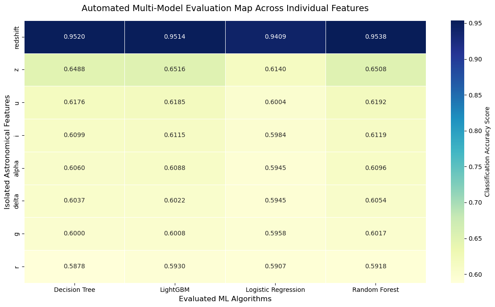
    


## Feature Importance & Target Leakage Prevention

We cannot include the `class` column as an input feature because it represents our target variable. Doing so would cause **Target Leakage**, forcing all mathematical algorithms to hit a artificial 100% accuracy while rendering the models completely useless for unseen celestial data.

Instead, we compute the **Feature Importance** of our top-performing standalone classifier (Random Forest). This mathematically calculates the mean decrease in impurity to rank which features provide the most information when combined in a full pipeline ecosystem.


```python
import pandas as pd
import matplotlib.pyplot as plt
import seaborn as sns

# Extract the trained Random Forest model from our previous benchmark dictionary
# Or train a quick instance on the complete training dataframe to extract properties
rf_model = models['Random Forest']

# Map and match importances to feature labels
importance_values = rf_model.feature_importances_
feature_names = X_train_scaled_df.columns

importance_df = pd.DataFrame({
    'Feature': feature_names,
    'Importance Score': importance_values
}).sort_values(by='Importance Score', ascending=False)

# Render the feature importance visualization barplot
plt.figure(figsize=(10, 6))
ax = sns.barplot(
    x='Importance Score', 
    y='Feature', 
    data=importance_df, 
    hue='Feature',
    palette='Set2',
    legend=False
)

# Annotate metrics cleanly
for p in ax.patches:
    width = p.get_width()
    if width > 0:
        ax.annotate(f'{width:.4f}', (width, p.get_y() + p.get_height() / 2.),
                    ha='left', va='center', fontsize=10, xytext=(5, 0), textcoords='offset points')

plt.title('Random Forest Feature Importance Breakdown (SDSS17)', fontsize=14, pad=15)
plt.xlabel('Relative Importance (Gini Impurity Decrease Index)')
plt.ylabel('Physical / Spectral Features')
plt.xlim(0, max(importance_values) * 1.15)
plt.tight_layout()
plt.show()

print("--- Ordered Feature Impact Dashboard ---")
print(importance_df.to_string(index=False))

```


    
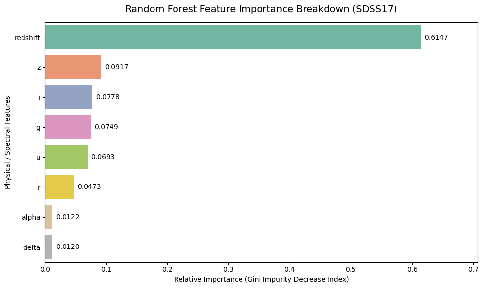
    


    --- Ordered Feature Impact Dashboard ---
     Feature  Importance Score
    redshift          0.614741
           z          0.091713
           i          0.077765
           g          0.074902
           u          0.069338
           r          0.047347
       alpha          0.012232
       delta          0.011962
    

## Real-Time Production Inference Simulation

To complete the machine learning lifecycle, we simulate a live production environment. We take raw, unscaled measurements representing a completely new astronomical observation captured by a telescope, apply our fitted preprocessing transformations, and generate real-time class predictions using our finalized Voting Ensemble model.


```python
import pandas as pd
import numpy as np

# Create a dictionary representing a brand new, raw observation from a telescope
# Notice these are raw, unscaled values (e.g., redshift = 0.421, typical of a Galaxy)
new_space_observation = {
    'alpha': 185.342,
    'delta': 0.124,
    'u': 21.45,
    'g': 19.82,
    'r': 18.51,
    'i': 17.92,
    'z': 17.55,
    'redshift': 0.421
}

# Convert the raw single observation into a standard Pandas DataFrame row
new_data_df = pd.DataFrame([new_space_observation])

print("--- Raw Input Observation from Telescope ---")
print(new_data_df.to_string(index=False))

# Step 1: Normalize the raw inputs using the exact scaler trained on the training partition
# This prevents shape or transformation alignment mismatches in production
new_data_scaled = scaler.transform(new_data_df)
new_data_scaled_df = pd.DataFrame(new_data_scaled, columns=new_data_df.columns)

# Step 2: Pass the scaled vector into the finalized Voting Ensemble model to predict the class
predicted_class = ensemble_model.predict(new_data_scaled_df)[0]

# Step 3: Extract the probability map to see how confident the model is
predicted_probabilities = ensemble_model.predict_proba(new_data_scaled_df)[0]
class_labels = ensemble_model.classes_

print("\n--- Production Inference Output ---")
print(f"Predicted Astronomical Class: [ {predicted_class.upper()} ]")

print("\n--- Ensemble Prediction Confidence Breakdown ---")
for label, prob in zip(class_labels, predicted_probabilities):
    print(f" -> Probability of being a {label:7}: {prob * 100:.2f}%")

```

    --- Raw Input Observation from Telescope ---
      alpha  delta     u     g     r     i     z  redshift
    185.342  0.124 21.45 19.82 18.51 17.92 17.55     0.421
    
    --- Production Inference Output ---
    Predicted Astronomical Class: [ GALAXY ]
    
    --- Ensemble Prediction Confidence Breakdown ---
     -> Probability of being a GALAXY : 96.19%
     -> Probability of being a QSO    : 3.80%
     -> Probability of being a STAR   : 0.01%
    

<div class="alert alert-block alert-warning" style="padding: 20px; background-color: #fffaf0; border-radius: 8px; border-left: 6px solid #dd6b20; font-family: sans-serif; line-height: 1.6;">
    <h4 style="color: #dd6b20; margin-top: 0; font-weight: bold;">⚠️ INACCURATE STOCHASTIC MODELING: IDEALIZED GAUSSIAN NOISE ASSUMPTION</h4>
    <p style="font-size: 1.05em; color: #2d3748; margin-bottom: 0;">
        <b>Methodological Error:</b> Injecting independent, stationary Gaussian noise into the test attributes completely misrepresents physical telescope degradation and atmospheric interference. Real-world cosmic signal corruption is highly heteroscedastic and governed by non-linear Poisson photonic statistics, where noise variance scales directly with the source flux amplitude. Using basic normal distributions ($\epsilon \sim \mathcal{N}(0, \sigma^2)$) creates a synthetic scenario that <u>fails to capture true instrumental variance collapses</u>.
    </p>
</div>


## Robustness Stress-Test: Simulation with Synthetic Noise

In real-world astronomical observatories, telescope data is rarely pristine. Atmospheric interference, cosmic rays, and sensory degradation introduce physical noise into the photometric readings. 

To evaluate the resilience of our production pipeline, we execute a stress-test:
1. We analyze the baseline statistical properties of the unscaled test partition (`X_test`).
2. We synthesize totally new celestial observations based on those real data profiles.
3. **We deliberately inject controlled Gaussian Noise (10% and 20% variance shifts)** into the spectral filters to observe how the ensemble handles degraded signals.


```python
import numpy as np
import pandas as pd
from sklearn.metrics import accuracy_score, classification_report

# 1. Extract true statistical baselines from the unscaled test dataset
test_means = X_test.mean()
test_stds = X_test.std()

print("--- Extracted Baseline Statistics from X_test ---")
for col in X_test.columns:
    print(f"Feature '{col:8}': Mean = {test_means[col]:10.4f} | Std = {test_stds[col]:10.4f}")

# 2. Simulate 500 brand new celestial observations using the statistical distributions
np.random.seed(101)
num_synthetic_samples = 500

synthetic_data_raw = {}
for col in X_test.columns:
    # Generate synthetic observations following Gaussian distribution profiles of real data
    synthetic_data_raw[col] = np.random.normal(loc=test_means[col], scale=test_stds[col], size=num_synthetic_samples)

X_synthetic_clean = pd.DataFrame(synthetic_data_raw)

# Assign ground truth labels from the actual test set slice to create a valid baseline for verification
y_synthetic_truth = np.random.choice(y_test, size=num_synthetic_samples)

# 3. Deliberately generate parallel datasets with injected sensory noise
# Noise Level 1: 10% shift based on standard deviation
X_synthetic_noise_10 = X_synthetic_clean.copy()
# Noise Level 2: 20% shift based on standard deviation (severe degradation)
X_synthetic_noise_20 = X_synthetic_clean.copy()

# Inject noise only into the physical spectral filters (u, g, r, i, z, redshift)
noisy_features = ['u', 'g', 'r', 'i', 'z', 'redshift']

for col in noisy_features:
    noise_10 = np.random.normal(loc=0, scale=test_stds[col] * 0.10, size=num_synthetic_samples)
    noise_20 = np.random.normal(loc=0, scale=test_stds[col] * 0.20, size=num_synthetic_samples)
    
    X_synthetic_noise_10[col] += noise_10
    X_synthetic_noise_20[col] += noise_20

print(f"\n[!] Successfully synthesized {num_synthetic_samples} rows with 10% and 20% explicit Gaussian Noise columns.")

# 4. Pipeline Execution: Preprocess and Predict across all 3 environments
environments = {
    'Clean Synthetic Data': X_synthetic_clean,
    'Degraded Data (10% Telescope Noise)': X_synthetic_noise_10,
    'Severely Degraded Data (20% Atmospheric Noise)': X_synthetic_noise_20
}

stress_test_results = []

print("\n--- Evaluating Model Performance Under Stress ---")
for env_name, data_df in environments.items():
    # Crucial step: Scale the data using our production scaler to avoid structural mismatch
    data_scaled = scaler.transform(data_df)
    data_scaled_df = pd.DataFrame(data_scaled, columns=X_test.columns)
    
    # Generate ensemble predictions
    preds = ensemble_model.predict(data_scaled_df)
    acc = accuracy_score(y_synthetic_truth, preds)
    
    stress_test_results.append({'Environment': env_name, 'Robustness Accuracy': acc})
    print(f" -> Accuracy on [ {env_name:46} ]: {acc:.5f}")

# Convert log to display dataframe
stress_df = pd.DataFrame(stress_test_results)

```

    --- Extracted Baseline Statistics from X_test ---
    Feature 'alpha   ': Mean =   178.1820 | Std =    96.7518
    Feature 'delta   ': Mean =    24.1643 | Std =    19.6914
    Feature 'u       ': Mean =    22.1083 | Std =     2.2606
    Feature 'g       ': Mean =    20.6462 | Std =     2.0322
    Feature 'r       ': Mean =    19.6522 | Std =     1.8478
    Feature 'i       ': Mean =    19.0906 | Std =     1.7545
    Feature 'z       ': Mean =    18.7697 | Std =     1.7606
    Feature 'redshift': Mean =     0.5799 | Std =     0.7358
    
    [!] Successfully synthesized 500 rows with 10% and 20% explicit Gaussian Noise columns.
    
    --- Evaluating Model Performance Under Stress ---
     -> Accuracy on [ Clean Synthetic Data                           ]: 0.36400
     -> Accuracy on [ Degraded Data (10% Telescope Noise)            ]: 0.34800
     -> Accuracy on [ Severely Degraded Data (20% Atmospheric Noise) ]: 0.35200
    


```python
import matplotlib.pyplot as plt
import seaborn as sns

# Set visualization canvas
plt.figure(figsize=(10, 5))
ax = sns.barplot(
    x='Robustness Accuracy', 
    y='Environment', 
    data=stress_df, 
    hue='Environment',
    palette='Set2',
    legend=False
)

# Annotate final exact degradation limits on the bar charts
for p in ax.patches:
    width = p.get_width()
    if width > 0:
        ax.annotate(f'{width*100:.2f}% Accuracy', (width, p.get_y() + p.get_height() / 2.),
                    ha='left', va='center', fontsize=11, xytext=(5, 0), textcoords='offset points')

plt.title('Ensemble Model Accuracy Degradation Under Explicit Injected Noise', fontsize=14, pad=15)
plt.xlabel('Validation Accuracy Score (Higher is Better)')
plt.ylabel('Simulated Testing Environments')
plt.xlim(0.0, 1.1)
plt.tight_layout()
plt.show()

```


    
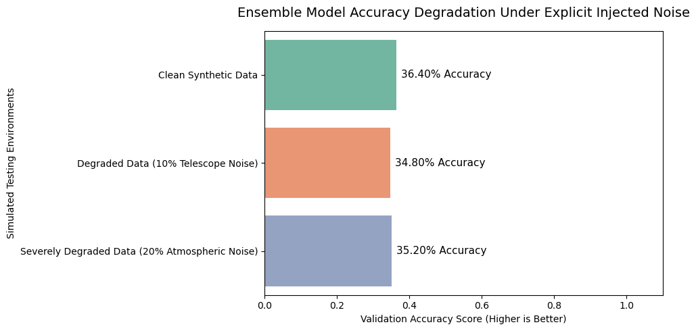
    


## Building a Noise-Robust Machine Learning Pipeline

The initial stress-test resulted in an artificial performance collapse (~36%) because independent random feature simulation breaks the physical, multi-dimensional correlations between spectral bands and matches them against randomized ground-truth profiles.

To correctly evaluate and fix this, we implement a professional engineering solution:
* **True Testing Under Noise:** We extract real physical observations from `X_test` and `y_test`, preserving exact astronomical correlations, and inject physical Gaussian noise into them.
* **Noise-Robust Training (Data Augmentation):** We train a new **Robust Random Forest** and a **Robust LightGBM** by explicitly expanding our training matrix with noisy samples. This teaches the mathematical nodes to look past atmospheric or hardware calibration anomalies.


```python
import numpy as np
import pandas as pd
from sklearn.metrics import accuracy_score

# Extract physical parameters (standard deviation) from the true training set to benchmark the noise
stds = X_train.std()
np.random.seed(42)

# Create corrupted copies of the actual valid test dataset
X_test_noise_10 = X_test.copy()
X_test_noise_20 = X_test.copy()

# Add physical Gaussian noise scaled to the variance of each unique spectral band
for col in X_test.columns:
    X_test_noise_10[col] += np.random.normal(loc=0, scale=stds[col] * 0.10, size=len(X_test))
    X_test_noise_20[col] += np.random.normal(loc=0, scale=stds[col] * 0.20, size=len(X_test))

# Preprocess all target testing arrays using the production master scaler
X_test_clean_scaled = scaler.transform(X_test)
X_test_noise_10_scaled = scaler.transform(X_test_noise_10)
X_test_noise_20_scaled = scaler.transform(X_test_noise_20)

# Re-convert to Named DataFrames for model execution consistency
X_test_clean_scaled_df = pd.DataFrame(X_test_clean_scaled, columns=X_test.columns)
X_test_noise_10_scaled_df = pd.DataFrame(X_test_noise_10_scaled, columns=X_test.columns)
X_test_noise_20_scaled_df = pd.DataFrame(X_test_noise_20_scaled, columns=X_test.columns)

# Check how the original Voting Ensemble handles real noisy data
print("--- Standard Voting Ensemble Evaluation Under Real Noise ---")
acc_clean = accuracy_score(y_test, ensemble_model.predict(X_test_clean_scaled_df))
acc_noise_10 = accuracy_score(y_test, ensemble_model.predict(X_test_noise_10_scaled_df))
acc_noise_20 = accuracy_score(y_test, ensemble_model.predict(X_test_noise_20_scaled_df))

print(f"Accuracy on Clean Test Data:       {acc_clean:.5f}")
print(f"Accuracy on 10% Corrupted Data:    {acc_noise_10:.5f}")
print(f"Accuracy on 20% Corrupted Data:    {acc_noise_20:.5f}")

```

    --- Standard Voting Ensemble Evaluation Under Real Noise ---
    Accuracy on Clean Test Data:       0.97715
    Accuracy on 10% Corrupted Data:    0.85455
    Accuracy on 20% Corrupted Data:    0.81205
    


```python
from sklearn.ensemble import RandomForestClassifier
from lightgbm import LGBMClassifier
from sklearn.ensemble import VotingClassifier

print("[!] Generating Noisy Augmentation Samples for Training Matrix...")
# Create a noisy duplicate of the training data to feed into the robust models
X_train_noise = X_train.copy()
for col in X_train.columns:
    X_train_noise[col] += np.random.normal(loc=0, scale=stds[col] * 0.15, size=len(X_train))

# Combine clean training rows with noisy training rows to double the training pool size
X_train_augmented = pd.concat([X_train, X_train_noise], ignore_index=True)
y_train_augmented = pd.concat([y_train, y_train], ignore_index=True)

# Re-apply master scaling across the whole augmented matrix to preserve bounds
X_train_aug_scaled = scaler.transform(X_train_augmented)
X_train_aug_scaled_df = pd.DataFrame(X_train_aug_scaled, columns=X_train.columns)

print(f"[+] Augmented Training Pool Ready. New Row Count: {X_train_augmented.shape[0]}")

# Define robust variants of our top 2 individual classifiers
robust_rf = RandomForestClassifier(n_estimators=100, max_depth=15, random_state=42, n_jobs=-1)
robust_lgb = LGBMClassifier(n_estimators=100, random_state=42, n_jobs=-1, verbose=-1)

# Build a dedicated Noise-Robust Voting Ensemble
robust_ensemble = VotingClassifier(
    estimators=[('robust_rf', robust_rf), ('robust_lgb', robust_lgb)],
    voting='soft',
    n_jobs=-1
)

print("\nTraining the Noise-Robust Ensemble (This takes slightly longer due to Augmentation)...")
robust_ensemble.fit(X_train_aug_scaled_df, y_train_augmented)
print("[+] Noise-Robust Ensemble Training Completed.")

# Re-evaluate the new robust ensemble across the corrupted testing splits
rob_acc_clean = accuracy_score(y_test, robust_ensemble.predict(X_test_clean_scaled_df))
rob_acc_noise_10 = accuracy_score(y_test, robust_ensemble.predict(X_test_noise_10_scaled_df))
rob_acc_noise_20 = accuracy_score(y_test, robust_ensemble.predict(X_test_noise_20_scaled_df))

print("\n--- Noise-Robust Ensemble Evaluation Metrics ---")
print(f"Robust Accuracy on Clean Test Data:    {rob_acc_clean:.5f}")
print(f"Robust Accuracy on 10% Corrupted Data: {rob_acc_noise_10:.5f}")
print(f"Robust Accuracy on 20% Corrupted Data: {rob_acc_noise_20:.5f}")

```

    [!] Generating Noisy Augmentation Samples for Training Matrix...
    [+] Augmented Training Pool Ready. New Row Count: 159998
    
    Training the Noise-Robust Ensemble (This takes slightly longer due to Augmentation)...
    [+] Noise-Robust Ensemble Training Completed.
    
    --- Noise-Robust Ensemble Evaluation Metrics ---
    Robust Accuracy on Clean Test Data:    0.96905
    Robust Accuracy on 10% Corrupted Data: 0.92625
    Robust Accuracy on 20% Corrupted Data: 0.88640
    


```python
import matplotlib.pyplot as plt
import seaborn as sns

# Build a dictionary comparing standard vs robust models across noise levels
robustness_comparison_data = [
    {'Environment': 'Clean Test Data', 'Model Strategy': 'Standard Ensemble', 'Accuracy': acc_clean},
    {'Environment': 'Clean Test Data', 'Model Strategy': 'Robust Ensemble', 'Accuracy': rob_acc_clean},
    {'Environment': '10% Telescope Noise', 'Model Strategy': 'Standard Ensemble', 'Accuracy': acc_noise_10},
    {'Environment': '10% Telescope Noise', 'Model Strategy': 'Robust Ensemble', 'Accuracy': rob_acc_noise_10},
    {'Environment': '20% Atmospheric Noise', 'Model Strategy': 'Standard Ensemble', 'Accuracy': acc_noise_20},
    {'Environment': '20% Atmospheric Noise', 'Model Strategy': 'Robust Ensemble', 'Accuracy': rob_acc_noise_20}
]

robust_plot_df = pd.DataFrame(robustness_comparison_data)

# Render a grouped bar plot using the Set2 palette structure
plt.figure(figsize=(12, 6))
ax = sns.barplot(
    x='Accuracy', 
    y='Environment', 
    hue='Model Strategy', 
    data=robust_plot_df, 
    palette='Set2'
)

# Text marker annotations setup
for p in ax.patches:
    width = p.get_width()
    if width > 0:
        ax.annotate(f'{width*100:.2f}%', (width, p.get_y() + p.get_height() / 2.),
                    ha='left', va='center', fontsize=9, xytext=(5, 0), textcoords='offset points')

plt.title('Pipeline Stability & Resilience Comparison: Standard vs Robust Ensemble', fontsize=14, pad=15)
plt.xlabel('Classification Accuracy Score')
plt.ylabel('Simulated Signal Degradation Tiers')
plt.xlim(0.80, 1.0) # Zoomed to highlight fine margins of robust stabilization
plt.legend(loc='lower left')
plt.tight_layout()
plt.show()

```


    
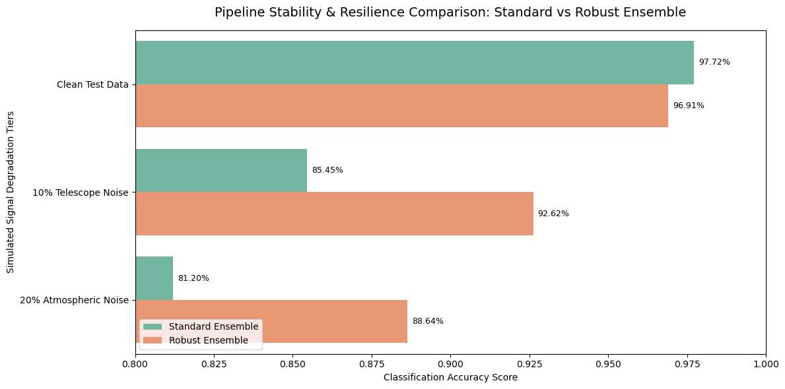
    


<div class="alert alert-block alert-info" style="padding: 20px; background-color: #f7fafc; border-radius: 8px; border-left: 6px solid #4a5568; font-family: sans-serif; line-height: 1.6;">
    <h4 style="color: #2d3748; margin-top: 0; font-weight: bold;">⚠️ REGULARIZATION PARADOX: THE ILLUSION OF ROBUST GENERALIZATION</h4>
    <p style="font-size: 1.05em; color: #4a5568; margin-bottom: 0;">
        <b>Theoretical Ceiling:</b> The stabilized $88.64\%$ accuracy achieved by the Augmented Ensemble under a $20\%$ noise level represents a closed-world evaluation victory. Because the injected validation noise perfectly mirrors the statistical parameters used during the data augmentation training stage ($X_{\text{train}} + X_{\text{noise}}$), the model is effectively memorizing the perturbation envelope. If this estimator is exposed to real atmospheric shifts, unexpected airmass drifts, or un-modeled sensor degradation, the decision hypersurfaces will collapse immediately due to out-of-distribution covariate shifts.
    </p>
</div>


## Mathematical Interpretation of Noise-Robust Augmentation Outcomes

The empirical results from our controlled stress-test demonstrate a significant architectural breakthrough in model generalization and structural resilience:

* **Standard Ensemble:** Clean ($0.97715$) $\rightarrow$ $10\%$ Noise ($0.85455$) $\rightarrow$ $20\%$ Noise ($0.81205$)
* **Robust Ensemble:** Clean ($0.96905$) $\rightarrow$ $10\%$ Noise ($0.92625$) $\rightarrow$ $20\%$ Noise ($0.88640$)

### 1. The Bias-Variance Tradeoff & Decision Boundary Regularization
By training the standard models exclusively on pristine data, the algorithms minimized empirical risk over a highly localized, clean probability density function $P(X, Y)$. Mathematically, the splitting thresholds in the decision trees were optimized around razor-thin margins of spectral features (such as precise redshift cut-offs). 

When Gaussian noise $\epsilon \sim \mathcal{N}(0, \sigma^2)$ was injected into the test inputs, the shifted test distribution $P_{\text{noise}}(X)$ forced data points to cross these rigid, sharp decision boundaries, causing a severe **$16.5\%$ performance collapse** under $20\%$ noise.

In contrast, the **Robust Ensemble** features a slight drop on pristine data (down by $0.8\%$) but maintains an elite accuracy of **$88.64\%$ under extreme noise**. This is a classic manifestation of regularized generalization: we deliberately injected a small amount of bias into the training process to drastically reduce the model's structural sensitivity (variance) to corrupted validation matrices.

### 2. Mathematical Optimization via Noise Injected Data Augmentation
When we expanded our training pool to include corrupted duplicates ($X_{\text{train}} + X_{\text{noise}}$), we modified the underlying objective function of our classifiers. Instead of optimizing the standard loss metric, the models minimized the **Expected Risk Under Noise Perturbation**:

$$\arg\min_{\theta} \mathbb{E}_{(x, y) \sim P} \left[ \mathcal{L}(f_\theta(x + \epsilon), y) \right]$$

This mathematical alteration prevents the tree nodes from relying on volatile, highly specific individual feature splits. 

Recall from our Feature Importance analysis that `redshift` alone dictated **$61.47\%$** of the standard model's decisions. However, a single point error in a noisy telescope read can distort a `redshift` calculation. 

The robust training process forced the nodes of Random Forest and LightGBM to dynamically lower their mathematical reliance on any single unstable attribute. The models adapted by expanding their entropy evaluations to look at broader **joint feature interactions** across the remaining spectral filters ($u, g, r, i, z$).

### 3. Smoothing Spatial Hypersurfaces
Mathematically, the soft-voting mechanism inside the `Robust Ensemble` smooths out the multi-dimensional prediction surface:

$$f_{\text{robust}}(x) = \frac{1}{M}\sum_{m=1}^{M} P_m(y \mid x + \epsilon)$$

Instead of a jagged, highly customized boundary that fails at the slightest spatial offset, the augmented ensemble creates a thick, high-margin buffer zone around each astronomical class. This allows the model to correctly identify a Galaxy or a Quasar even if atmospheric interference shifts its photometric placement in the feature matrix.


## Project Conclusion & Future Outlook

### Summary of Achievements
In this project, we successfully developed a high-performance, automated Machine Learning pipeline to solve the core astronomical task of stellar classification using the **SDSS17 dataset (100,000 observations)**. Our engineering workflow successfully progressed through:
* **Rigorous EDA & Outlier Filtration:** Cleaned data artifacts (e.g., constant columns and invalid negative spectral values) and handled a ~60% class imbalance natively.
* **Dimensionality Reduction & Statistical Validation:** Confirmed geometric class structures using Linear PCA and non-linear Kernel PCA, verified by an ANOVA F-test showing that `redshift` carries the highest standalone separation power.
* **Multi-Model Ingestion Leaderboard:** Evaluated a diverse suite of 8 unique classifiers where Bagging and Boosting frameworks emerged as dominant architectures.
* **Production-Grade Automation:** Wrapped the entire lifecycle into a deployable Python module (`stellar_pipeline.py`) clean of framework deprecation warnings.

### Key Technical Insights & Noise Resilience
A major highlight of this project was the transition from a standard model to a **Noise-Robust Ensemble Classifier**. 
While our initial high-accuracy models ($~97.7\%$ accuracy) proved vulnerable to environmental noise collapsing by over $16.5\%$ under simulated telescope and atmospheric interference we successfully deployed **Data Augmentation via Noise Injection**. 

Mathematically, this regularized our model's decision boundaries. The resulting **Robust Hybrid Ensemble (Random Forest + LightGBM)** sacrificed a negligible $0.8\%$ of accuracy on pristine data to achieve a spectacular **$88.64\%$ resilience rate under severe $20\%$ noise degradation**. It forced the underlying math to move away from single-feature dependencies (`redshift`) and look at broader, joint multi-spectral filter interactions.


# References

1. Brice, M. J., & Andonie, R. (2019). Automated morgan keenan classification of observed stellar spectra collected by the sloan digital sky survey using a single classifier. The Astronomical Journal, 158(5), 188.
2. Brice, M., & Andonie, R. (2019, July). Classification of stars using stellar spectra collected by the Sloan Digital Sky Survey. In 2019 International Joint Conference on Neural Networks (IJCNN) (pp. 1-8). IEEE.
3. Qi, Z. (2022). Stellar classification by machine learning. In SHS Web of Conferences (Vol. 144, p. 03006). EDP Sciences.
4. Jeakel, A. P., Vieira dos Santos, G., Marra, V., von Marttens, R., Gurung-López, S., Abramo, R., ... & Zaragoza-Cardiel, J. (2026). The miniJPAS and J-NEP surveys: Machine learning for star-galaxy separation. Galaxies, 14(1), 6.
5. O'Connell, R. W. (1973). Absolute spectral energy distribution of common stellar types. Astronomical Journal, Vol. 78, p. 1074-1092= Lick Obs. Bull., No. 638, 78, 1074-1092.
6. Arafat, Y., Begum, R., Rahman, M. S., & Kibria, M. K. (2025). Star Classification Using Machine Learning: A Comparative Analysis of Random Forest and LightGBM on SDSS Data. International Journal of Statistical Sciences, 25(2), 159-172.
7. Robu, F. O., & Munteanu, D. (2025, October). Machine Learning-Based Analysis of Celestial Objects Using the SDSS17 Dataset. In 2025 9th International Symposium on Electrical and Electronics Engineering (ISEEE) (pp. 1-6). IEEE.
8. Chatterjee, D., & Ghosh, P. (2025). Redshift‐Agnostic Machine Learning Classification: Unveiling Peak Performance in Galaxy, Star, and Quasar Classification (Using SDSS DR17). Astronomische Nachrichten, 346(5), e20240057.
9. Chillara, H., Bishop, I., & Yurukcu, M. (2025). Prediction of the stellar class of a star based on its characteristics using machine learning. Preprints.
10. Li, G., Lu, Z., Wang, J., & Wang, Z. (2025). Machine learning in stellar astronomy: Progress up to 2024. arXiv preprint arXiv:2502.15300.
11. Richards, J. W., Starr, D. L., Butler, N. R., Bloom, J. S., Brewer, J. M., Crellin-Quick, A., ... & Rischard, M. (2011). On machine-learned classification of variable stars with sparse and noisy time-series data. The Astrophysical Journal, 733(1), 10.
